# 10장 리액트 17과 18의 변경 사항 살펴보기

- [10장 리액트 17과 18의 변경 사항 살펴보기](#10장-리액트-17과-18의-변경-사항-살펴보기)
  - [10.2 리액트 18 버전 살펴보기](#102-리액트-18-버전-살펴보기)
    - [10.2.1 새로 추가된 훅 살펴보기](#1021-새로-추가된-훅-살펴보기)
      - [`useId`](#useid)
      - [`useTransition`](#usetransition)
      - [`useDeferredValue`](#usedeferredvalue)
      - [`useSyncExternalStore`](#usesyncexternalstore)
      - [`useInsertionEffect`](#useinsertioneffect)
    - [10.2.2 react-dom/client](#1022-react-domclient)
      - [`createRoot`](#createroot)
      - [`hydrateRoot`](#hydrateroot)

## 10.2 리액트 18 버전 살펴보기

리액트 17에서 점진적인 업그레이드를 위한 준비를 했다면 리액트 18에서는 리액트 17에서 못했던 다양한 기능들이 추가되었다. 그중 가장 큰 변경점은 **동시성 지원**이다.

---

### 10.2.1 새로 추가된 훅 살펴보기

리액트 18에서는 훅을 대거 추가했는데, 이는 앞으로도 함수형 컴포넌트 사용이 주를 이룰 것이라는 리액트 팀의 방향성으로 볼 수 있다. 함께 새로운 훅들을 살펴보도록 하자.🧐

---

#### `useId`

유니크한 값을 생성하는 새로운 훅, 고유한 ID 생성을 위한 간편하고 효율적인 방법을 제시한다.

**개요**
컴포넌트 내부에서 사용할 수 있는 유니크한 값을 생성하는 것<sup>[1](#footnote_1)</sup>은 어려운 일이다. 하나의 컴포넌트가 여러 군데에서 재사용되는 경우도 고려해야하고, 리액트 컴포넌트 트리에서 컴포넌트가 가지는 모든 값이 겹치지 않고 다 달라야 한다는 제약도 있다. 서버 사이드 렌더링 환경에서 하이드레이션<sup>[2](#footnote_1)</sup>이 일어날 때에도 서버와 클라이언트에서 동일한 값을 가져야 에러가 발생하지 않으므로 이러한 점도 고려해야 한다.

<a name="footnote_1">1</a>: 컴포넌트에서 유니크한 값을 사용하는 예시 1. 고유한 키 생성 (컴포넌트 리스트가 반복 요소를 렌더링) 2. 고유한 ID 생성, 랜덤 값 생성, 고유한 토큰 생성

<a name="footnote_2">2</a> : 하이드레이션 - 데이터를 객체로 변환하는 과정, 주로 JSON 형식의 데이터를 가져와서 해당 데이터를 프로그래밍 언어에서 사용할 수 있는 객체로 변환하는 것을 의미

<br/>

**주요 역할**
요소의 속성에 고유한 ID를 할당하고, 관련된 여러 요소 간에 일관된 ID 접두사를 사용한다.

<br/>

**특징**
- 서버와 클라이언트 간 일관성 유지
  - 클라이언트와 서버에서 불일치를 피하면서 컴포넌트 내부의 고유한 값을 생성할 수 있다.
- 사용 편의성
  - 수동으로 고유 ID 생성, 관리하는 번거로움을 줄일 수 있다.

<br/>

```jsx
export default function UniqueComponent() {
  return <div>{Math.random()}</div>
}

// Text content did not match.
// Server: "0.3247863..." Client: "0.1234678..."
```

💣 `UniqueComponent` 를 서버 사이드에서 렌더링하면 에러가 발생한다.

💁🏻‍♀️ `WHY?`
서버에서 렌더링했을 때의 `Math.random()` 값과 클라이언트에서 해당 결과물을 받고 이벤트를 입히기 위한 하이드레이션 ( JSON -> 언어 ) 을 했을 때의 `Math.random()` 값이 다르기 때문이다.

서비스에서 컴포넌트별로 고유한 값을 사용하기 위해서 반드시 하이드레이션을 고려해야 했던 리액트 17에서는 굉장히 까다로운 작업이었다.

그러나 새로운 훅인 `useId` 를 사용하면 클라이언트와 서버에서 불일치를 피하면서 컴포넌트 내부의 고유한 값을 생성할 수 있게 되었다.

```jsx
import {useId} from 'react';

function Child() {
  const id = useId()
  return <div>child: {id}</div>
}

function SubChild() {
  const id = useId()

  return (
    <div>
      Sub Child:{id}
      <Child />
    </div>
  )
}

export defatult function Random() {
  const id = useId()
  return (
    <>
      <div>Home: {id}</div>
      <SubChild />
      <SubChild />
      <Child />
      <Child />
      <Child />
    </>
  )
}
```

위의 컴포넌트를 서버 사이드에서 렌더링하면 아래와 같은 HTML 을 확인할 수 있다.

```HTMl
<div>
  <div>
    Home:
    <!-- -->:Rm:
  </div>
  <div>
    Sub Child:<!-- -->:Ram:
    <div>
      child:
      <!-- -->:R7am:
    </div>
  </div>
  <div>
    Sub Child:<!-- -->:Rem:
    <div>
      child:
      <!-- -->:R7em:
    </div>
  </div>
  <div>
    child:
    <!-- -->:Rim:
  </div>
  <div>
    child:
    <!-- -->:Rmm:
  </div>
  <div>
    child:
    <!-- -->:Rqm:
  </div>
</div>
```

같은 컴포넌트임에도 서로 인스턴스가 다르면 다른 랜덤한 값을 만들어 내며, 값들은 모두 유니크하다. 또한 하이드레이션 이슈도 발생하지 않는다.
이 `useId` 가 생성하는 값은 `:` 로 감싸져 있는데, CSS 선택자나 `querySelector` 에서 작동하지 않도록 하기 위한 의도적인 결과이다.

리액트 `useId` 에 관련된 자세한 알고리즘은 리액트 깃허브 저장소<sup>[3](#footnote_3)</sup>에서 확인할 수 있다.

<a name="footnote_3">3</a>: https://bit.ly/48GDSCc

---
#### `useTransition`

UI 변경을 가로막지 않고 상태를 업데이트할 수 있는 훅

💁🏻‍♀️ 상태 업데이트를 긴급하지 않은 것으로 간주해 무거운 렌더링 작업을 조금 미룰 수 있으며, 사용자에게 조금 더 나은 사용자 경험을 제공한다.

<br/>

> 💣 여기서 잠깐! 💣
> 긴급한 업데이트 (urgent update) 란!?
>
>> 리액트 개발 화면에서의 UI 업데이트는 두 가지 유형이 있다. **긴급한 업데이트**와 **긴급하지 않은 업데이트**이다.
>>사용자가 타이필할 때 UI 업데이트가 느리면 실행 도중 화면이 깜빡거리거나 입력이 느려지는 등의 문제가 생길 수도 있다. 이처럼 사용자에게 즉각적인 피드백을 전달해야하는 업데이트를 **긴급한 업데이트**(urgent update)라고 한다.
>> 사용자가 입력한 필드의 값을 이용해 백엔드의 데이터를 조회해서 화면을 갱신하는 작업이 있다. 이는 **긴급하지 않은 업데이트**(non-urgent update) 혹은 **전환**(transition)이라고 부른다.

:thinking: 문제 상황 :thinking:
애플리케이션 실행 도중 긴급하지 않은 업데이트로 인해 사용자에게 즉각적으로 피드백해야 하는 작업이 느려지게 되면 사이트의 성능 이슈가 발생합니다.

전환 기능은 `애플리케이션에서 긴급한 업데이트를 우선 처리할 수 있도록 긴급하지 않아도 되는 UI 업데이트 부분을 전환 업데이트로 지정하는 기능`이다.

<!-- 출처 : https://despiteallthat.tistory.com/276 -->

~ 682 페이지의 예제 코드 ~
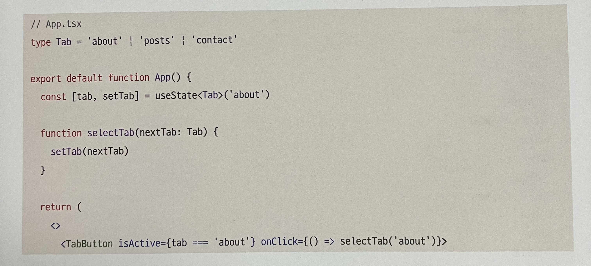
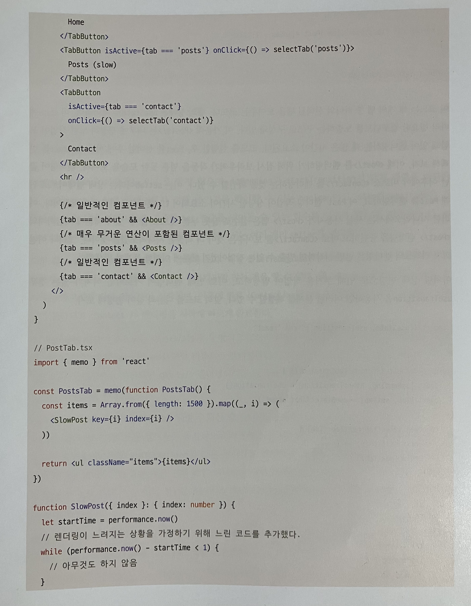
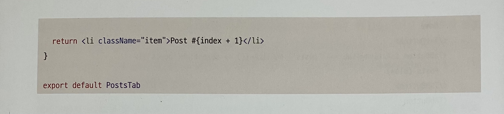

세 개의 탭 중 하나의 선택된 탭을 보여주는 코드
탭의 상태는 `useState`로 관리하며, 이 `state`에 따라 필요한 컴포넌트를 노출하는 구조로 구성되어 있다.

이 중 `<Post/>` 는 굉장히 느린 작업이 포함되어 있다.

`Post` 를 선택한 후에 `Contact`을 바로 선택해보자. `<Post/>`를 렌더링하기 위해 잠시 멈춘 것처럼 보이며 렌더링이 끝난 후에야 `<Contact/>`를 렌더링한다. `setTab`이라는 상태 업데이트로 인해 `Post`를 렌더링 작업에 시간이 소요되어 UI 렌더링을 가로막기 때문이다.

이러한 경우에는 사용자가 `Post` 탭을 실수로 누른 것으로 생각된다. 그러므로 `<Post/>` 렌더링을 중단하고 `<Contact/>` 를 보여주는 것이 더 적절하게 보인다.

이처럼 상태 변경으로 인해 무거운 작업이 발생하고, 이로 인해 렌더링이 가로막힐 여지가 있는 경우 `useTransition` 을 사용하여 문제를 해결 할 수 있다.

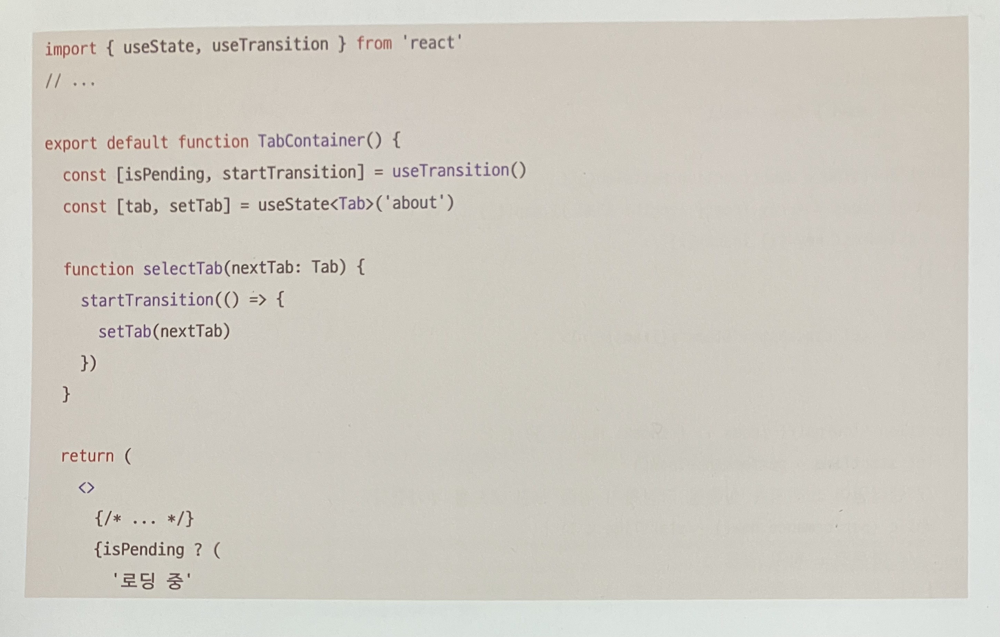
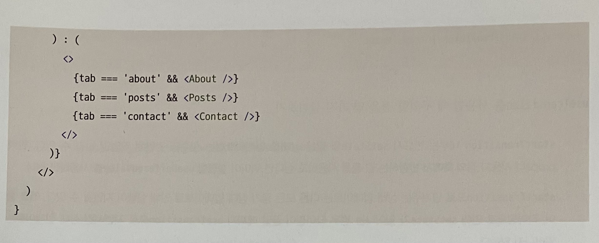

`useTransition` 은 아무것도 인수로 받지 않으며,
`isPending`과 `startTransition`이 담긴 배열을 반환한다.

- `isPending` : 상태 업데이트가 진행 중인지를 확인할 수 있는 `boolean`
- `startTransition` : 긴급하지 않은 상태 업데이트로 간주할 `set` 함수를 넣어둘 수 있는 함수

여기서는 `() => {setTab(nextTab)}`을 인수로 받았지만 경우에 따라 여러개의 `setter`를 넣어줄 수 있다.

이렇게 `setTab`을 `useTransition`을 통해 처리하면 이전과 다르게 탭을 아무리 선택해도 렌더링이 블로킹되지 않는다.

`<Post/>`를 클릭하면 '로딩 중' 이라는 메시지와 함께 렌더링이 시작되며,
이후에 바로 `<Contact/>` 탭으로 넘어가면 그 즉시 `<Post/>`의 렌더링이 중단되고 `<Contact/>` 렌더링을 시작해 빠르게 완료한다.

💁🏻‍♀️ 렌더링에 시간이 소요되는 `<Post/>`는 즉각 렌러딩하지 않고 마치 `async` 와 `await` 처럼 비동기로 렌더링한다.
`<Post/>` 렌더링 와중에 다른 상태 업데이트로 전환되면 `<Post/>` 렌더링이 취소될 수도, 완성될 때까지 기다리며 다른 렌더링을 가로막지 않을 수 있다.

`useTransition`은 리액트 18의 변경 사항의 핵심 중 하나인 동시성을 다룰 수 있는 새로운 훅이며, 컴포넌트에서만 사용 가능하다.

**주의할 점**
- `startTransition` 내부는 반드시 `setState`와 같은 상태를 업데이트하는 함수와 관련된 작업만 넘길 수 있다. 만약 `props`나 사용자 정의 훅에서 반환하는 값 등을 사용하고 싶다면 `useDefferedValue` 를 사용한다.
- `startTransition`으로 넘겨주는 상태 업데이트는 다른 모든 동기 상태 업데이트로 인해 실행이 지연될 수 있다. 예를 들어, 타이핑으로 인해 `setState`가 일어나는 경우 타이핑이 끝날 때까지 `useTransition` 으로 지연시킨 상태 업데이트는 일어나지 않는다.
- `startTransition` 으로 넘겨주는 함수는 반드시 동기 함수여야 한다. 만약 이 안에 `setTimeout` 과 같은 비동기 함수를 넣으면 제대로 작동하지 않게 된다. `startTransition`이 작업을 지연시키는 작업과 비동기로 함수가 실행되는 작업 사이에 불일치가 일어나기 때문이다.

---

#### `useDeferredValue`

리액트 컴포넌트 트리에서 리렌더링이 급하지 않은 부분을 지연할 수 있게 도와주는 훅, 특정 시간 동안 발생하는 이벤트를 하나로 인식해 한 번만 실행하게 해주는 `debounce`와 비슷하지만 `useDeferredValue`만이 가진 장점이 있다.


|`debounce`|`useDeferredValue`|
|--|--|
|고정된 지연 시간 필요|고정된 지연 시간 없이 첫 번째 렌더링이 완료된 이후에 `useDeferredValue`로 지연된 렌더링을 수행|

 💁🏻‍♀️ 지연된 렌더링은 중단할 수 있으며, 사용자의 인터랙션을 차단하지 않는다.

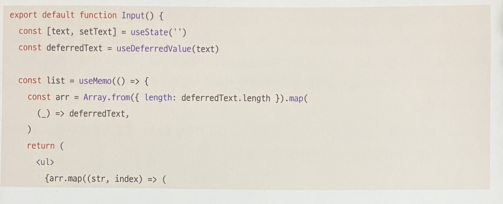
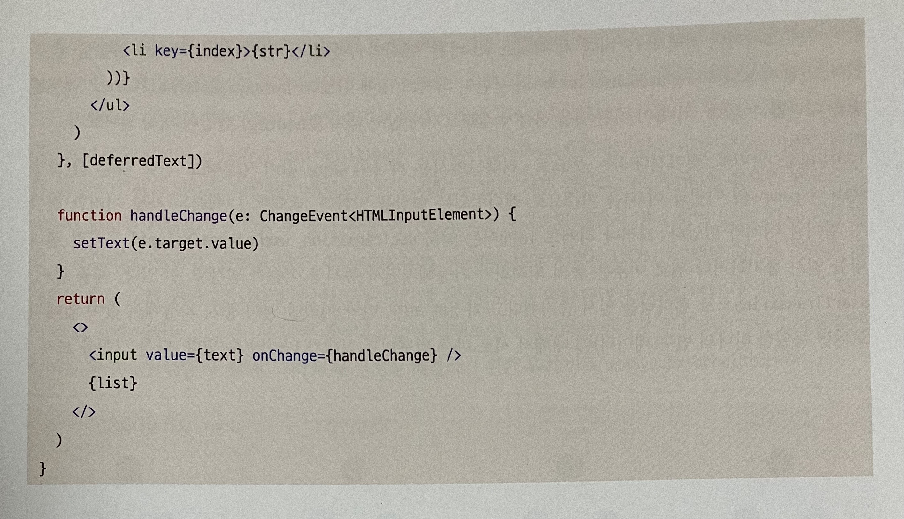

`list`를 생성하는 기준을 `text`가 아닌 `deferredText`로 설정함으로써 잦은 변경이 있는 `text`를 먼저 업데이트 해 렌더링하고, 이후 여유가 있을 때 지연된 `defferedText`를 활용해 `list`를 새로 렌더링하게 된다.
`list` 에 있는 작업이 더 무겁고 오래 걸릴수록 `useDeferredValue`를 사용하는 이점이 커진다.


|`useTransition`|`useDefferedValue`|
|--|--|
|`state` 값을 업데이트하는 함수를 감싸서 사용|`state` 값 자체만을 감싸서 사용|
|낮은 우선순위로 처리해야 할 작업에 대해 직접적으로 상태를 업데이트할 수 있는 코드에 접근할 수 있을 때|컴포넌트의 `props`와 같이 상태 업데이트에 관여할 수 없고 오로지 값만 받아야 하는 상황일 때|

공통점 : 지연된 렌더링을 한다

---

#### `useSyncExternalStore`

`useSyncExternalStore` 는 간단히 외부 상태를 관리하기 위한 훅이다.

먼저 리액트 17 까지 존재했던 `useSubscribtion` 에 대해 알아보자.
`useSyncExternalStore` 훅은 `useSubscribtion` 의 대체품이기 때문이다.

<br/>

**테어링 (tearing) 현상**
'tearing'은 영어로 '찢어진다'라는 뜻으로, 리액트에서는 하나의 `state` 값이 있음에도 서로 다른 값 (보통 `state` 나 `props` 의 이전과 이후) 을 기준으로 렌더링되는 현상이다. 즉, UI 가 동일한 상태에 대해 여러 형태를 나타냄을 의미한다.

리액트 17에서는 이러한 문제점이 일어날 여지가 없었지만, 리액트 18에 앞서 `useTransition`, `useDefferedValue` 처럼 렌더링을 일시 중지하거나 뒤로 미루는 등의 최적화가 가능해지면서 동시성 이슈가 발생할 수 있다.

`startTransition` 으로 렌더링을 일시 중지했다고 가정했을 때, 중지 과정에서 값이 업데이트되면 동일한 하나의 변수(데이터)에 대해 서로 다른 컴포넌트 형태가 나타날 수 있다.


1. 첫 번째 컴포넌트에서는 외부 데이터 스토어의 값이 파란색이었으므로 파란색을 렌더링했다.
2. 나머지 컴포넌트들도 파란색으로 렌더링을 준비하고 있었다.
3. 그러다가 갑자기 외부 데이터 스토어의 값이 빨강색으로 변경되었다.
4. 나머지 컴포넌트들은 렌더링 도중에 바뀐 색을 확인하고 빨강색으로 렌더링했다.
5. 결과적으로 같은 데이터 소스를 바라보고 있음에도 컴포넌트의 색상이 달라지는 **테어링 현상**이 발생했다.

리액트에서 관리하는 `state`라면 `useTransition`, `useDefferedValue` 와 같이 내부적으로 이러한 문제를 해결할 수 있지만, 외부 데이터 소스<sup>[4](#footnote_4)</sup>에서라면 문제가 달라진다.

<a name="footnote_4">4</a> 글로벌 변수, `document.body`, `window.innerWidth`, `DOM`, 리액트 외부에 상태를 저장하는 외부 상태 관리 라이브러리 (`Redux` 등)

`useState`나 `useReducer`가 아닌 모든 것들은 외부 데이터 소스인데, **외부 데이터 소스에 동시성 처리가 추가되어 있지 않다면 테어링 현상이 발생**할 수 있다.

💁🏻‍♀️ 이 문제를 해결하기 위한 훅이 바로 `useSyncExternalStore` 이다.

```jsx
import { useSyncExternalStore } from 'react';

// useSyncExternalStore(
//   subscribe: (callback) => Unsubscribe
//   getSnapshot: () => State
// ) => State
```

3가지 인수를 가진다.
> **subscribe**
: 콜백함수를 받아 스토어에 등록하는 용도로 사용되며, 스토어에 있는 값이 변경되면 이 콜백이 호출되어야 한다.

> **함수**
: 컴포넌트에 필요한 현재 스토어의 데이터를 반환하는 함수이다. 스토어가 변경되지 않았다면 매번 함수를 호출할 때마다 동일한 값을 반환해야 한다. 스토어에서 값이 변경됐다면 이 값을 이전 값과 `Object.is` 로 비교한 뒤 리렌더링한다.

> **옵셔널 값**
: 서버 사이드 렌더링 시에 내부 리액트를 하이드레이션하는 도중에만 사용된다. 서버 사이드에서 렌더링되는 훅이라면 반드시 이 값을 넘겨줘야 하며, 클라이언트의 값과 불일치가 발생할 경우 오류가 발생한다.

5.2절 '리액트 훅으로 시작하는 상태 관리'에서의 공통점
- 외부 값을 렌더링하기 위한 작동 방식
  - 리액트 외부에서 데이터를 관리하고 이를 렌더링까지 이어지게 하기 위한 `subscribe` 함수 추가
  - `Object.is` 를 통한 렌더링 값 비교
- 리렌더링을 발생시키기 위해 `useState`나 `useReducer`를 어색하게 호출하는 동작이 없다.
  - 어딘가에 콜백을 등록하고, 이 콜백이 호출될 때마다 렌더링을 트리거하는 장치가 마련돼 있다는 사실을 알 수 있다.

690p : `useSyncExternalStore` 훅 사용 예제
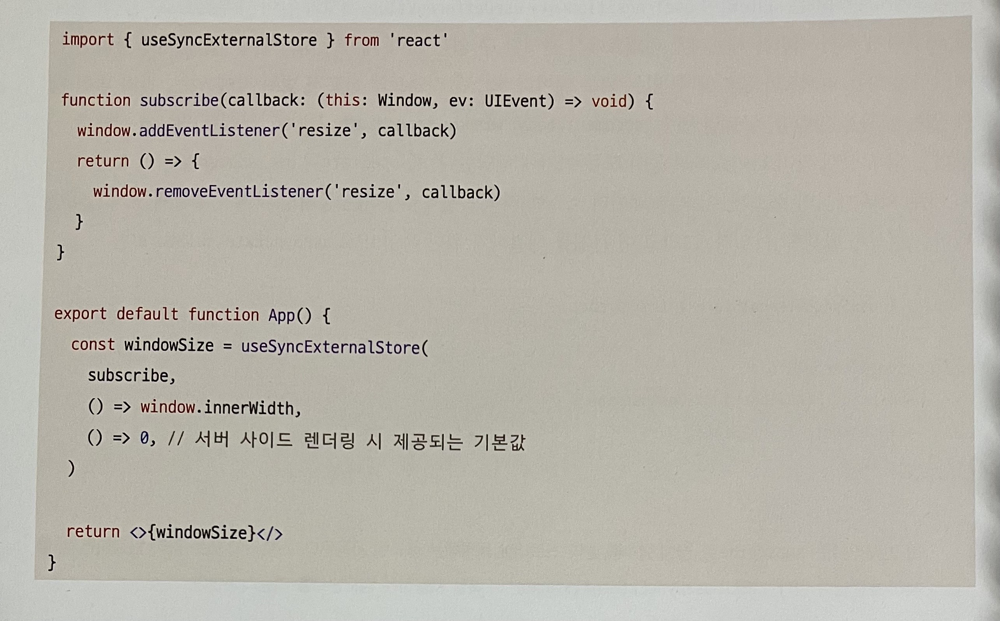

현재 윈도우의 `innerWidth`를 확인하는 코드이다.
`innerWidth` 는 리액트 외부의 데이터 값이므로 변경 여부를 확인해 리렌더링까지 이어지게 하려면 `useSyncExternalStore` 의 사용이 매우 적절하다.

`subscribe` 함수를 첫 번째 인수로 넘겨 `innerWidth` 가 변경될 때 일어나는 콜백을 등록했다.
`subscribe` 함수의 첫 번째 인수인 콜백을 추가해 `resize` 이벤트가 발생할 때마다 콜백이 실행되게끔 할 것이다.
두 번째 인수로는 현재 스토어의 값인 `window.innerWidth`를, 마지막으로 서버 사이드에서는 해당 값을 추적할 수 없으므로 0을 제공했다.

이를 하나의 훅으로 만들어서 다음과 같이 사용할 수도 있다.


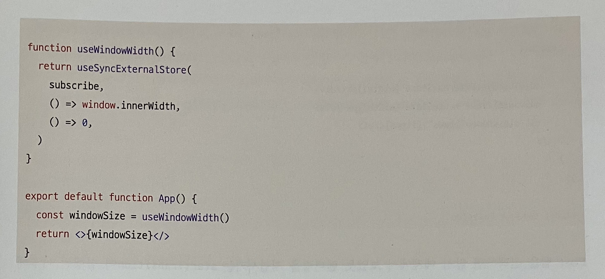

예제 : `useSyncExternalStore` 없이 비슷한 훅을 만들기

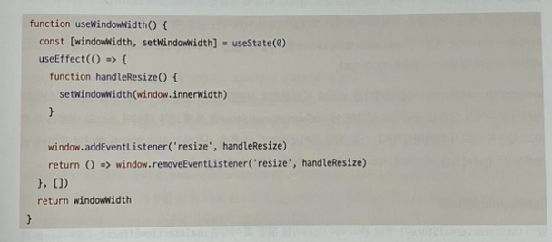

예제 : `useTransition` 을 사용한 예제에서 두 가지 훅을 추가해 차이를 알아보자.

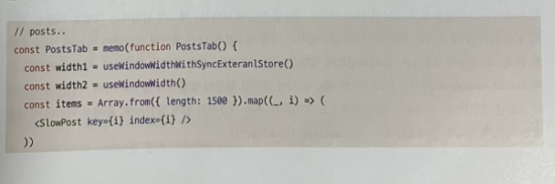
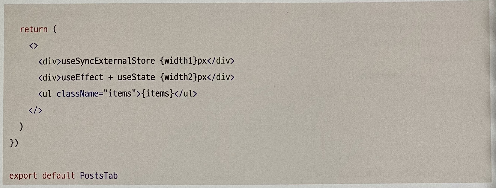

`Post` 탭 선택 ➡ 렌더링을 지연시키는 `startTransition` 실행 ➡ `PostTab` 노출
➡ `startTransition` 이후 `width` 를 보자!
|`useSyncExternalStore` 사용|미사용|
|:--:|:--:|
|렌더링 이후에 정확하게 바로 현재 width 를 가져옴|아예 값을 가져오지 못하고 초깃값인 0 나타냄|

💁🏻‍♀️ 즉, 외부에 상태가 있는 데이터에는 반드시 `useSyncExternalStore` 를 통해 외부 데이터 소스의 변경을 추적하고 있는지 반드시 확인해야 한다.

~~그렇지 않다면 렌더링 중간에 발생하는 값 업데이트를 적절하게 처리하지 못하고 테어링 현상이 발생한다.~~

---

#### `useInsertionEffect`

`CSS-in-js` 라이브러리를 위한 훅이다.

**개요**
`_document.tsx`에 `styled-components`가 사용하는 스타일을 모두 모아서 서버 사이드 렌더링 이전에 `<style>` 태그에 삽입하는 작업을 해봤었다.
CSS 의 추가 및 수정은 브라우저에서 렌더링하는 작업 대부분을 다시 게산해 작업해야 하는만큼, 매우 무거운 작업이다. 따라서 리액트 17과 `styled-components` 에서는 클라이언트 렌더링 시에 이러한 작업이 발생하지 않도록 서버 사이드에서 스타일 코드를 삽입했다. 그러나 이 작업을 훅으로 처리하는 것은 쉽지 않았는데, 이러한 작업을 도와주는 훅이 `useInsertionEffect` 이다.

`useInsertionEffect` 의 기본적인 구조는 `useEffect`와 동일하지만, 실행 시점에 차이가 있다.

훅 내부에 스타일을 삽입하는 코드를 집어넣음으로써 브라우저가 레이아웃을 계산하기 전에 실행될 수 있게하여, 자연스러운 스타일 삽입을 가능하게 한다.

693p : `useEffect`, `useLayoutEffect`, `useInsertionEffect` 의 실행 순서
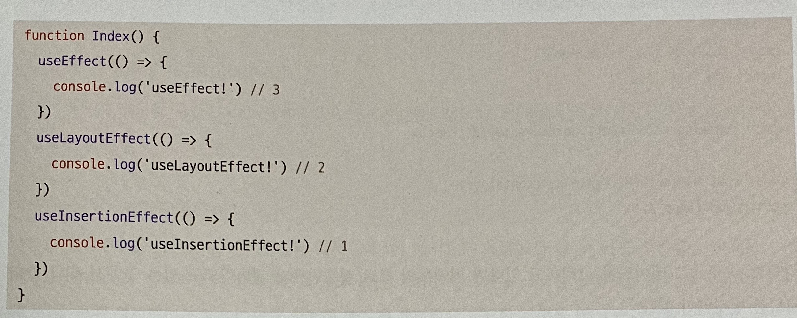

`useLayoutEffect` 과 비교했을 때,
두 훅 모두 브라우저에 DOM 이 렌더링되기 전에 실행되지만

|`useInsertionEffect`|`useLayoutEffect`|
|:--:|:--:|
|`DOM` 변경 작업 이전에 실행|모든 `DOM`의 변경 작업이 다 끝난 이후에 실행|

💁🏻‍♀️ 브라우저가 다시 스타일을 입혀 `DOM` 을 재계산하지 않아도 된다는 점에서 매우 큰 차이점이다.

<br/>
<br/>

> `useSyncExternalStore`과 마찬가지로 `useInsertionEffect` 는 실제 애플리케이션 코드를 작성할 때 사용될 일이 거의 없으므로 가급적 사용하지 않는 것이 좋다.

---

### 10.2.2 react-dom/client

클라이언트에서 리액트 트리를 만들 때 사용되는 API가 변경되었다. 만약 리액트 18 이하 버전에서 만든 `create-react-app` 으로 프로젝트를 유지보수 중이라면 리액트 18로 업그레이드할 때 반드시 `index.{t|j}jsx`에 있는 내용을 변경해야 한다.

#### `createRoot`

기존의 `react-dom` 에 있던 `render` 메서드를 대체할 새로운 메서드이다.
리액트 18의 기능을 사용하고 싶다면 `createRoot`와 `render`을 함께 사용해야 한다.

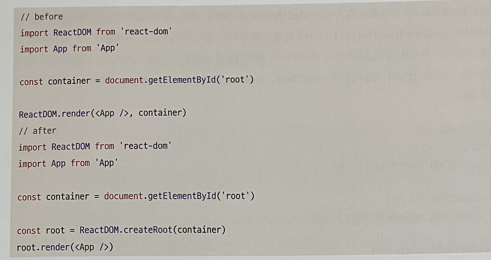

리액트 18로 업그레이드를 고려하고 있다면 리액트의 루트 컴포넌트가 렌더링되고 있는 곳에서 위와 같이 코드를 변경해야 한다.

---

#### `hydrateRoot`

서버 사이드 렌더링 애플리케이션에서 하이드레이션을 하기 위한 새로운 메서드이다.
React DOM 서버 API 와 함께 사용된다.

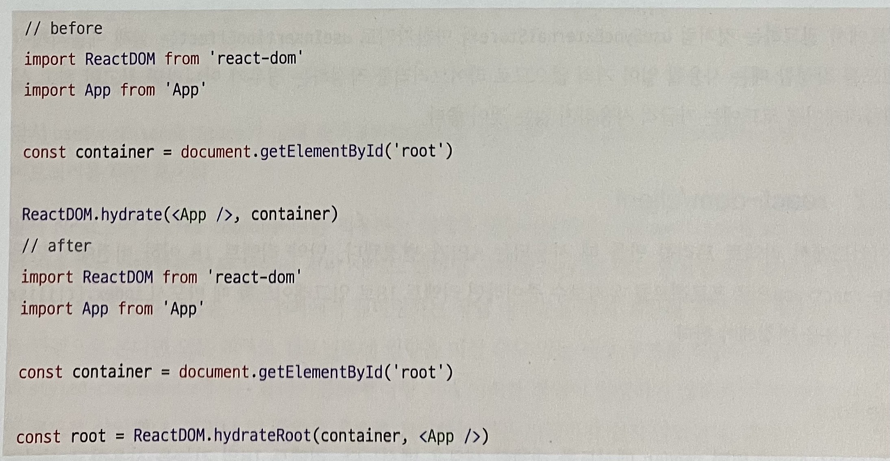

대부분의 서버 사이드 렌더링은 프레임워크에 의존하고 있을 것이므로 사용하는 쪽에서 수정할 일은 거의 없는 코드이다.
하지만 자체적으로 서버 사이드 렌더링을 구현해서 사용하고 있다면 수정이 필요하다.

