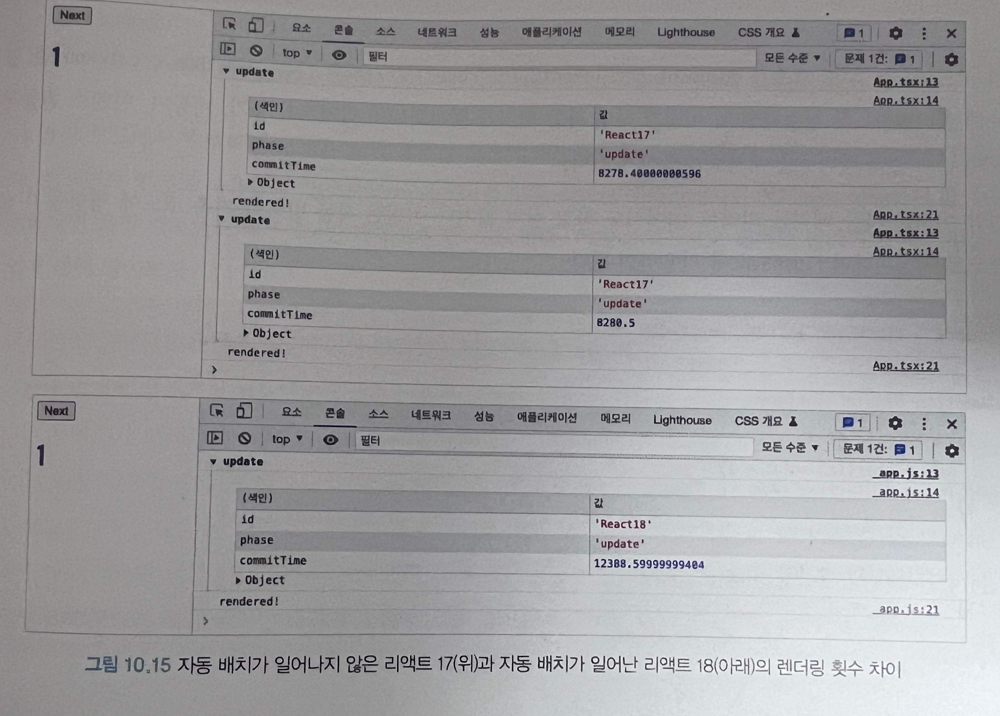
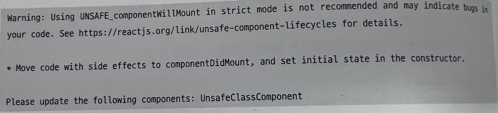

# 10장 리액트 17과 18의 변경 사항 살펴보기

- [10장 리액트 17과 18의 변경 사항 살펴보기](#10장-리액트-17과-18의-변경-사항-살펴보기)
  - [10.2 리액트 18 버전 살펴보기](#102-리액트-18-버전-살펴보기)
    - [10.2.3 react-dom/server](#1023-react-domserver)
    - [10.2.4 자동 배치(Automatic Batching)](#1024-자동-배치automatic-batching)
    - [10.2.5 더욱 엄격해진 엄격 모드](#1025-더욱-엄격해진-엄격-모드)
    - [10.2.6 Suspense 기능 강화](#1026-suspense-기능-강화)
    - [10.2.8 정리](#1028-정리)

## 10.2 리액트 18 버전 살펴보기

### 10.2.3 react-dom/server

클라이언트의 변화와 마찬가지로 서버에서 컴포넌트를 생성하는 API 변경이 있었습니다. 어떤것들이 추가되었는지 살펴 보겠습니다.

`renderToPipeableStream`

리액트 컴포넌트를 HTML로 렌더링하는 메서드 입니다.

스트림을 지원하는 메서드로 HTML을 점진저긍로 렌더링하고 클라이언트에서는 중간 script를 삽입하는 등의 작업을 할 수 있습니다.
서버에서 Suspense를 사용하여 빠르게 렌더링이 필요한 부분을 먼저 렌더링을 할 수 있고, 값 비싼 연산으로 구성된 부분은 이후에 렌더링 되게끔 할 수 있습니다.

예제 코드를 살펴보겠습니다

```js
function render(url, res) {  // res 는 HTTP 응답
  let didError = false

  // 서버에서 필요한 데이터를 불러오고, 데이터를 불러오는데 시간이 오래걸린다고 가정해보기
  const data = createServerData()
  const stream = renderToPipeableStream(

    // 데이터를 Context API 로 넘기기
    <DataProvider data={data}>
    <App assets={assets}>
    </DataProvider>,
    {
      boostrapScripts : [assets['main.js']],
      onShellReady() {
        // 에러 발생 시 처리 추가
        res.statusCode = didError ? 500 : 200
        res.setHeader('Content-type', 'text/html')
        stream.pipe(res)
      },
      onError(x) {
        didError = true
        console.log(x)
      },
    },
  )
  // 렌더링 시작 이후 일정 시간이 흐르면 렌더링에 실패한 것으로 간주 후 취소
  setTimeOut(() => stream.abort(), ABORT_DELAY)
}

export default function App({assets}) {
  return (
    <Html assets={assets} title='Hello'>
    <Suspanse fallback={<Spinner>}>
    <ErrorBoundary FallbackComponent={Error}>
    <Content/>
    </ErrorBoundary>
    </Suspanse>
    </Html>
  )
}

function Content(){
  return (
    <Layout>
    <NavBar/>
<article className="post">
<section className='comments'>
<h2>Comments</h2>
// 데이터가 불러오기 전 보여줄 컴포넌트
    <Suspanse fallback={<Spinner>}>
// 데이터가 불러오기 전 보여줄 컴포넌트
<Comments/>
</section>
<h2>Thanks for reading!</h2>
</article>
    <Layout/>
  )
}
```

`renderToPipeableStream` 을 사용하면 최초에 브라우저는 아직 불러오지 못한 데이터 부분을 Suspense 의 fallback 으로 받는다.

그리고 `createServerData` 의 데이터 로딩이 끝나면 `<Comments/>` 가 데이터를 가지고 렌더링이 됩니다.

원래라면 렌더링이 순서대로 진행이되고, 순서에 의존하기에 이전 렌더링이 완료되지 않는다면 이후 렌더링도 끝나지 않는다. 였었습니다.
그러나 이번에 추가된 `renderToPipeableStream` 을 활용하면 순서나 오래 걸리는 렌더링에 영향 받을 필요 없이 빠르게 렌더링을 수행할 수 있습니다.

사용하는 경우가 거의 없겠지만 참고정도 하시면 좋을듯합니다 !

### 10.2.4 자동 배치(Automatic Batching)

`자동 배치 (Automatic Batching)`은 리액트가 여러 상태 업데이트를 하나의 리렌더링으로 묶어서 성능을 향상시키는 방법을 의미합니다. 예를 들면 버튼 클릭 한 번에 두 개 이상의 state를 동시에 업데이트한다고 사정해보면 자동배치는 이를 하나의 리렌더링으로 묶어서 수행이 가능합니다.

```ts
const sleep = (ms: number) => {
  return new Promise((resolve) => setTimeOut(resolve, ms));
};

export default function App() {
  const [count, setCount] = useState(0);
  const [flag, setFlag] = useState(false);

  const callback = useCallback(
    (id, phase, actualDuration, baseDuration, startTime, commitTime) => {
      console.group(phase);
      console.table({ id, phase, commitTime });
      console.groupEnd();
    },
    []
  );

  useEffect(() => {
    console.log("rendered");
  });

  function handleClick() {
    sleep(3000).then(() => {
      setCount((c) => c + 1);
      setFlag((f) => !f);
    });
  }
}

return (
  <Profiler id="React18" onRender={callback}>
    <button onClick={handleClick}> next </button>
    <h1 style={{ color: flag ? "blue" : "black" }}>{count}</h1>
  </Profiler>
);
```

아래 사진은 위의 예시 코드 결과를 가져온 모양입니다.

위의 사진은 React 17 아래 사진은 React 18 인데
18 에서의 자동배치를 이용하여 리렌더링이 한번만 되는걸 확인할 수 있습니다.


17 이하의 버전에서는 이벤트 핸들러 내부에서는 자동 배치 작업이 이뤄지고 있었지만 Promise, setTimeOut 같은 비동기 이벤트에서는 자동배치가 이뤄지지 않았다고 합니다.

즉, 동기와 비동기 배치 작업에 일관성이 없었고, 이를 보완하기위해서 18버전부터는 루트 컴포넌트를 createRoot를 사용해 만들어서 모든 업데이트가 배치 작업으로 최적화 할 수 있게 만들었다고 합니다.

```js
const rootElement = document.gerElementById("root");
const root = ReactDOM.createRoot(rootElement);

root.render(
  <React.StrictMode>
    <App />
  </React.StrictMode>
);
```

자주 보셨을 이 코드는 자동배치가 활성화되어 리액트 동기, 비동기, 이벤트 핸들러 등에 관계 없이 렌더링을 배치로 수행하게 합니다.

### 10.2.5 더욱 엄격해진 엄격 모드

엄격모드란 리액트에서 제공하는 컴포넌트 중 하나로, 애플리케이션에서 발생할 수도 있는 버그를 찾는데 도움을 줍니다. 흔히 알고 있는 Fragment, Suspense와 마찬가지로 컴포넌트 형태로 선언해서 사용이 가능합니다.

엄격모드는 모두 개발자 모드에서만 작동을하고, 프로덕션 모드에서는 작동하지 않습니다.

클래스형 컴포넌트에서 생명주기로 사용되었던 `componentWillMount`, `componentWillReceiveProps`, `componentWillUpdata` 는 더 이상 사용이 안됩니다. 위의 메서드들은 16.3 부터 `UNSAFE_` 가 붙게 되었고 16 버전 이후 부터는 `UNSAFE_`가 붙지 않는 생명주기 메서드를 사용하게 되면 경고 로그가 남고 , 17 부터는 `UNSAFE_` 붙은 3가지 메서드만 남기고 다 삭제되었습니다. 그럼에도 불구하고 `UNSAFE_`가 붙은 메서드를 사용하고 싶고 그 상태에서 엄격모드를 켜가 된다면 에러가 나옵니다.



이제 향후 리액트 팀에서는 컴포넌트가 마운트 해체된 상태에서도 컴포넌트 내부의 상태값을 유지할 수 있는 기능을 제공한다고 팀에서 밝혔습니다.
예를 든다면 사용자가 뒤로가기를 했다가 다시 현재 화면으로 돌아왔을때, 리액트가 즉시 이전의 상태를 그대로 유지해 표시할 준비를 하는 기능을 추가할 것이다. 라는 의미입니다. 컴포넌트가 최초에 마운트될 때, 자동으로 모든 컴포넌트를 마운트 해체하고 두번째 마운트에서 이전 상태를 복원하게 된다. 라는 의미로도 이해하면 좋을것같습니다.

### 10.2.6 Suspense 기능 강화

`Suspense` 는 16.6 버전에서 실험 버전으로 도입된 기능으로 컴포넌트를 동적으로 가져올 수 있게 도와주는 기능입니다.

```js
expert default function SampleComponent (){
  return <> 동적으로 가져오는 컴포넌트 </>
}
const DynamicSampleComponent = lazy(() => import('/SampleComponent'))

export default function App(){
  return (
    <Suspense fallback={<ㄴ>로딩중</>}>
    <DynamicSampleComponent/>
    </Suspense>
  )
}
```

`React.lazy`는 첫번째 렌더링시에 불러오지 않고 최초 렌더링 이후에 컴포넌트를 지연시켜 불러오는 역할을 합니다. 그리고 이렇게 불러온 `SampleComponent` 가 `Suspense`로 감싸져 있는데 여기서 `Suspense`는 `React.lazy`를 통해 지연시켜 불러온 컴포넌트를 렌더링하는 역할을 합니다.

lazy, `Suspense`는 한쌍으로 사용이되고 애플리케이션에서 상대적으로 중요하지 않은 컴포넌트를 분할해 초기 렌더링 속도를 향상시키는데 많은 도움을 줍니다.

이제 Suspense가 18 이전에는 실험버전 이였다면 이제는 정식 버전으로 지원이 됩니다. 구체적으로 변경내용을 살펴보겠습니다.

- 아직 마운트되기 직전임에도 effect가 빠르게 실행되는 문제를 수정, 이제 컴포넌트가 실제로 화면에 노출될 때 effect tlfgod
- Suspense로 인해 컴포넌트가 보이거나 사라질 때도 effect가 정상적으로 실행, 이전에는 컴포넌트가 Suspense로 인해 보여지는 숨겨져 있는지 알 수가 없었다. 하지만 이제는 Suspense 에 의해 노출이 된다면 useLayoutEffect 의 effect가, 가려진다면 useLayoutEffect의 cleanup이 정상적으로 실행 된다.
- Suspense를 이제 서버에서도 실행이 가능하다. CustomSuspense를 구현하지 않더라도 정상적으로 Suspense를 사용할 수 있다.
  서버에서 일단 fallback 상태의 트리를 클라이언트에 제공하고 불러올 준비가 된다면 자연스럽게 렌더링 된다.
- Suspense 내에 스로틀링이 추가 됐다. 화면이 너무 자주 업데이트 되어 시각적으로 방해되는 것을 방지하고 리액트는 다음 렌더링을 보여주기 전에 잠시 대기한다. 즉, 중첩된 Suspense의 fallback이 있다면 자동으로 스로틀되어 최대한 자연스럽게 보여주기 위해 노력했다.

### 10.2.8 정리

리액트 17 버전 업은 단순히 리액트 버전 업을 조검 더 쉽게 만드는데 초점을 줬다면, 리액트 18은 17에서 하지못한 버전 업을 한꺼번에 한 것 같은 느낌이 들 정도로 많은 변화가 있었습니다.

리액트 18의 버전업의 핵심은 동시성 렌더링입니다.

과거 렌더링 과정은 중간에 일시 중지를 한다거나 렌더링 도중에 해당 렌더링 결과물을 포기한다든가 하는 메커니즘이 없었다. 무조건 한번 시작하면 끝을 봐야하는 작업이였습니다.
하지만 이제 18에서는 달라졌습니다. 렌더링 중간에 일시 중지하거나, 나중에 여유롭게 다시 시작하거나, 진행 중인 렌더링 작업을 포기하고 다시 새로 시작할 수도 있습니다.
렌더링 과정은 훨씬 복잡해졌지만 리액트는 이 과정에서도 UI가 일관성 있게 표시할 수 있도록 보장합니다.

결국 리액트팀은 동시성 렌더링이 작동하게끔 목표로 하고 있고, 이러한 변화는 리액트 내에 있는 라이브러리, 특히 외부에서 상태를 관리하는 상태관리 라이브러리들에게 큰 변화를 가져왔습니다.
앞으로 리액트 18이 앞으로 리액트 생태계에 있어서 큰 이정표가 될것이라고 생각합니다. 우리가 개발할 무언가가 동시성 모드를 염려해 두고 있다면 사용하고자 하는 라이브러리 들이 이를 완벽하게 지원하는지 반드시 검토 후에 사용을 해야할 것같습니다.
