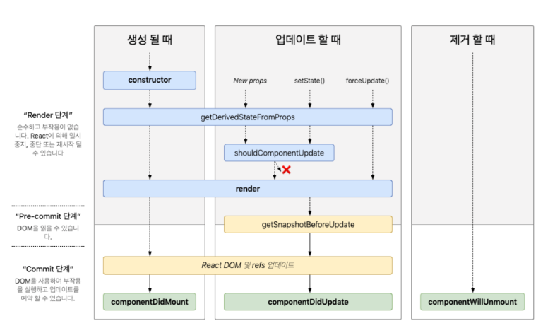

# 2장 리액트 핵심 요소 깊게 살펴보기

- [2장 리액트 핵심 요소 깊게 살펴보기](#2장-리액트-핵심-요소-깊게-살펴보기)
- [2.3 클래스형 컴포넌트와 함수형 컴포넌트](#23-클래스형-컴포넌트와-함수형-컴포넌트)
  - [2.3.1 클래스형 컴포넌트](#231-클래스형-컴포넌트)
        - [기본적인 클래스형 컴포넌트의 구조](#기본적인-클래스형-컴포넌트의-구조)
        - [컴포넌트를 만들 때 주로 쓰이는 `props`,`state`, `메서드` 정의하기](#컴포넌트를-만들-때-주로-쓰이는-propsstate-메서드-정의하기)
        - [생명주기 메서드가 실행되는 시점](#생명주기-메서드가-실행되는-시점)
    - [클래스형 컴포넌트의 생명주기 메서드](#클래스형-컴포넌트의-생명주기-메서드)
      - [🌳🌲 생명주기에서 실행되는 메서드 🍃🍂](#-생명주기에서-실행되는-메서드-)
      - [생명주기 다이어그램](#생명주기-다이어그램)
      - [💣 에러 상황에서 실행되는 메서드 🔫](#-에러-상황에서-실행되는-메서드-)
      - [컴포넌트의 두 가지 유형 차이점](#컴포넌트의-두-가지-유형-차이점)
      - [클래스형 컴포넌트의 한계](#클래스형-컴포넌트의-한계)

# 2.3 클래스형 컴포넌트와 함수형 컴포넌트

함수형 컴포넌트에 훅이 등장한 이후 함수형 컴포넌트에서 상태나 생명주기 메서드 비슷한 작업을 흉내 낼 수 있게 되자 상대적으로 보일러플레이트가 복잡한 클래스형 컴포넌트보다 함수형 컴포넌트를 더 많이 쓰기 시작했다.

**🙄 의문점 🤷🏻‍♀️❓**

함수형 컴포넌트에서는 생명주기 메서드를 어떻게 써야할까?
기존 클래스형 컴포넌트 코드를 모두 함수형으로 변경해야 할까?
클래스형 컴포넌트는 언젠가 지원 중단되는 것일까?
클래스형 컴포넌트는 이제 몰라도 되는걸까?

**🧐 공부할 것 📑**

클래스형 컴포넌트와 함수형 컴포넌트의 차이점
각각의 컴포넌트를 작성할 때 고려해야할 것

**😎 얻을 것 🤗**
클래스형 컴포넌트에 대한 이해를 넓히고
기존 리액트 코드를 리팩터링하고 유지보수하는 데 많은 도움이 될 것!

## 2.3.1 클래스형 컴포넌트

##### 기본적인 클래스형 컴포넌트의 구조
```js
import React from 'react';

class MyComponent extends React.Component {
  render() {
    return <div>Sample Componenet</div>;
  }
}

export default MyComponent;
```

클래스형 컴포넌트 만들기
: 클래스 선언, `extends` 하기

`extends` 구문에 넣을 수 있는 클래스
: - `React.Component`
: - `React.PureComponent`

=> 둘의 차이는 `ShouldComponentUpdate`를 다루는 데에 있다.

클래스형 컴포넌트를 만들 때는 ES6의 클래스 문법을 사용하며, `React.Component`를 상속받아야 한다.

<br/>

##### 컴포넌트를 만들 때 주로 쓰이는 `props`,`state`, `메서드` 정의하기

💁🏻‍♀️`SampleProps`와 `SampleState` 라는 두 개의 인터페이스를 통해 `props`와 `state`의 타입을 정의하고, `SampleComponent` 클래스에서 사용해보자!

```js
import React from 'react'

// props 타입을 선언한다.
interface SampleProps {
  required?: boolean
  text: string
}

// state 타입을 선언한다.
interface SampleState {
  count: number
  isLimited?: boolean
}

----------------------------------------------------------------------------

🤓💬
SampleProps : props 의 타입을 정의하는 인터페이스
2개의 속성
- text : 필수, string 타입
- required : 선택적, boolean 타입

🤓💬
SampleState : state 의 타입을 정의하는 인터페이스
2개의 속성
- count : 필수, number 타입
- isLimited : 선택적, boolean 타입

----------------------------------------------------------------------------

// Component에 제네릭으로 props, state를 순서대로 넣어준다.
class SampleComponent extends React.Component<SampleProps, SampleState> {
  // constructor 에서 props 를 넘겨주고, state 의 기본값을 설정한다.
  private constructor(props: SampleProps) {
    super(props)
    this.state = {
      count: 0,
      isLimited: false,
    }
  }

  ----------------------------------------------------------------------------
  👩🏻‍💻
  class SampleComponent extends React.Component

  🤓💬
  SampleComponent 라는 이름의 클래스 컴포넌트를 생성한다.
  React.Component 를 확장 ( extends )하여 만들어진다.

  👩🏻‍💻
  <SampleProps, SampleState>

  🤓💬
  컴포넌트가 받을 props 타입을 SampleProps 로,
  관리할 state 의 타입을 SampleState 로 지정한다.

  👩🏻‍💻
  private constructor(props: SampleProps) :
  
  🤓💬
  클래스의 생성자 함수를 정의한다. 이 함수는 컴포넌트가 생성될 때 한 번만 호출된다.
  부모 클래스인 React.Component 의 생성자 함수를 호출하면서 props 를 전달한다.
  private 으로 선언되어 컴포넌트 외부에서 호출할 수 없다.

  👩🏻‍💻
  this.state = { count: 0, isLimited: false }

  🤓💬
  컴포넌트의 초기 state 를 { 중괄호 } 안의 값으로 설정한다.
  this.state는 컴포넌트 내부에서 사용되는 상태를 관리하는 객체이다.
  this.setState 메서드를 통해 업데이트할 수 있다.

  ----------------------------------------------------------------------------

  // render 내부에서 쓰일 함수를 선언한다.
  private handleClick = () =? {
    const newValue = this.state.count + 1
    this.setState({ count: newValue, isLimited: newValue >= 10 })
  }

  ----------------------------------------------------------------------------

  🤓💬

  사용자가 버튼을 클릭했을 때 호출되는 함수, private 으로 선언되어 컴포넌트 외부에서 호출 불가능

  현재 count 상태값에 1을 더한 값을 newValue 에 할당한다.

  count 값을 업데이트하고, newValue 가 10 이상이면 isLimited 를 true 로 설정하여
  count 가 10 이상이면 더 이상 증가하지 않게 한다.

  ----------------------------------------------------------------------------


  //render 에서 이 컴포넌트가 렌더링할 내용을 정의한다.
  public render() {
    // props 와 state 값을 this, 즉 해당 클래스에서 꺼낸다.
    const {
      props: { required, text },
      state: { count, isLimited },
    } = this

  ----------------------------------------------------------------------------

  🤓💬

  컴포넌트가 화면에 어떻게 표지될지 정의하는 함수,
  public 으로 선언되어 컴포넌트 외부에서도 호출 가능

  this 즉, 현재 컴포넌트 인스턴스에서 props 와 state 값을 추출하여 사용한다.

  ----------------------------------------------------------------------------

    return (
      <h2>
        Sample Component
        <div>{required ? '필수' : '필수 아님'}</div>
        <div>문자: {text}</div>
        <div>count: {count}</div>
        <button onClick={this.handleClick} disabled={isLimited}>
          증가
        </button>
      </h2>
    )
  }
}
```

메서드 : 렌더링 함수 내부에서 사용되는 함수이며, 보통 DOM에서 발생하는 이벤트와 함께 사용된다.

( `constructor`, `handleClick`, `render`)

1. `construnctor` 에서 `this` 바인드 하기
    - 일반적인 함수로 메서드를 만든다면 this 가 undefined 로 나오는 현상이 일어난다.
    - 생성자가 아닌 일반 함수로 호출하게 되면 this 에 전역 객체가 바인딩되기 때문이다.
    - 따라서 Javascript 클래스에서 메서드를 선언할 때, 그 메서드 내부에서 this 를 사용하려면 생성된 함수에 bind 를 활용해 this 를 메서드에 바인딩해야 한다.

    ```this.handleClick = this.handleClick.bind(this)```

<br/>

2. 화살표 함수 사용

    - 실행 시점이 아닌 작성 시점에 this가 상위 스코프로 결정되는 화살표 함수를 사용한다면 굳이 바인딩하지 않고 사용할 수 있다.

<br/>

3. 렌더링 함수 내부에서 함수를 새롭게 만들어 전달하기

    - ```<button onClick={() => this.handleClick()}> 증가 </button>```
    - 매번 랜더링이 일어날 때마다 새로운 함수를 생성해서 할당하게 되므로 최적화 수행에 어려움이 생긴다.

<br/>

##### 생명주기 메서드가 실행되는 시점

|마운트 mount|업데이트 update|언마운트 unmount|
|--|--|--|
|컴포넌트가 마운팅(생성)되는 시점|이미 생성된 컴포넌트의 내용이 변경(업데이트)되는 시점|컴포넌트가 더 이상 존재하지 않는 시점|

<br/>

### 클래스형 컴포넌트의 생명주기 메서드

#### 🌳🌲 생명주기에서 실행되는 메서드 🍃🍂

`render()`
: 리액트 클래스형 컴포넌트의 유일한 필수 값으로 항상 쓰인다.
**용도** : 컴포넌트가 UI를 렌더링
**실행 시기** : 마운트와 업데이트 과정
**주의할 점** : 항상 순수해야 한다. 같은 입력값(props 또는 state)이 들어가면 항상 같은 결과물을 반환해야 한다. 함수 내부에서 `state` 를 직접 업데이트하는 `this.setState` 를 호출하면 안 된다.
**`this.setState` 사용 가능 여부** : 불가능

`componentDidMount()`
: 컴포넌트가 마운트되고 준비된 뒤 그다음으로 호출되는 생명주기 메서드
**실행 시기** : 컴포넌트가 마운트되고 준비되는 즉시 실행
**`this.setState` 사용 가능 여부** : 가능
함수 내부에서 `this.setState()`로 `state` 값 변경 가능하다.
하지만 성능 문제를 일으킬 수 있으니 `state` 를 다루는 것은 생성자에서 하도록 해야한다.

`componentDidUpdate()`
: **용도** : `state`나 `props` 의 변화에 따라 DOM을 업데이트
**실행 시기** : 컴포넌트 업데이트가 일어난 이후 실행
**`this.setState` 사용 가능 여부** : 가능
**주의할 점** : 적절한 조건문으로 감싸주지 않으면 `this.setState`가 계속해서 호출된다.


`componentWillUnmount()`
: **용도** : 이벤트 지우기, API 호출 취소, `setInterval`, `setTimeout`으로 생성된 타이머를 지우는 작업
**실행 시기** : 컴포넌트가 언마운트되거나 더 이상 사용되지 않기 직전에(DOM에서 제거되기 직전) 호출 = 메모리 누수나 불필요한 작동을 막기 위한 클린업 함수를 호출하기 위한 최적의 위치
**`this.setState` 사용 가능 여부** : 불가능

`shouldComponentUpdate()`
: **용도** :  `state`나 `props`의 변경으로 리액트 컴포넌트가 다시 리렌더링되는 것을 막기 위함, 컴포넌트에 영향을 받지 않는 변화에 대해 정의
**실행 시기** : 이미 `this.setSTate`가 호출되어 `state`가 업데이트 되는 과정에 있을 떄
**`this.setState` 사용 가능 여부** : 불가능 -> 무한루프 발생
**주의할 점** : 특정한 성능 최적화 상황에서만 고려하여 사용해야 함

`static getDerivedStateFromProps()`
: **용도** : `componentWillReceiveProps` 를 대체
다음에 올 `props`를 바탕으로 현재의 `state`를 변경
**실행 시기** : `render()` 호출하기 직전
**`this.setState` 사용 가능 여부** : `static`으로 선언되어 있기 때문에 `this` 자체에 접근 불가능
**주의할 점** : 모든 `render()` 실행 시에 호출된다

`getSnapShotBeforeUpdate()`
: **용도** : `componentWillUpdate` 를 대체
DOM에 렌더링되기 전에 윈도우 크기를 조절하거나 스크롤 위치를 조정하는 작업
반환되는 값은 `componentDidUpdate`로 전달됨
**실행 시기** : DOM 이 업데이트되기 직전에 호출
**`this.setState` 사용 가능 여부** : 불가능

<br/>

#### 생명주기 다이어그램


리액트의 컴포넌트는 `생성` => `업데이트` => `제거`의 생명주기를 가지고 있다.

|생성|업데이트|제거|
|--|--|--|
|`constructor`에 의해 `state` 초기화, `render` 메서드 실행되며 DOM에 컴포넌트를 마운트 => 마운트 완료 후 `componentDidMount` 메서드 실행|`props`가 새롭게 전달되거나 상태가 업데이트 되는 경우 `re-rendering`을 진행하며 DOM에 변화된 부분을 업데이트 => 업데이트 완료 후 `componentDidUpdate` 실행|DOM에 나타나있던 컴포넌트가 마운트 해제될 경우 제거되기 직전에 `componentWillUnmount` 실행, `componentDidMount()`에서 생성된 작업 등을 정리할 때 사용됨|

<br/>


#### 💣 에러 상황에서 실행되는 메서드 🔫

`getDerivedStateFromError()`
: 자식 컴포넌트에서 에러가 발생했을 때 호출되는 에러 메서드
**용도** : 에러 처리 로직 구현, 하위 컴포넌트에서 에러가 발생했을 경우 어떻게 자식 리액트 컴포넌트를 렌더링할지 결정
**특징** : `static` 메서드로, 하위 컴포넌트에서 발생한 에러를 뜻하는 `error`를 인수로 받는다.
**주의할 점** : 반드시 `state` 값을 반환해야 한다. 렌더링 과정에서 호출되는 메서드이기 때문에 `state` 값을 반환하는 것 외의 부수 효과가 일어나면 안 된다.

`componentDidCatch()`
: **용도** : 에러 발생 시 이 메서드에서 제공되는 에러 정보를 바탕으로 로깅하는 등
**특징** : 두 개의 인수, `getDerivedStateFromError` 와 동일한 *`error`* 와 정확히 어떤 컴포넌트가 에러를 발생시켰는지 정보를 가진 *`info`*를 가진다.
커밋 단계에서 실행되기 때문에 부수 효과 수행 가능
**실행 시기** : 자식 컴포넌트에서 에러가 발생했을 때, `getDerivedStateFromError`에서 에러를 잡고 `state`를 결정한 이후

<br/>

💁🏻‍♀️💁🏻‍♀️ **정리**
`ErrorBoundary`, 즉 에러 경계 컴포넌트를 만들기 위한 목적으로 많이 사용된다.
두 메서드를 사용한 클래스형 컴포넌트는 리액트 애플리케이션 전역에서 처리되지 않은 에러를 처리하기 위한 용도로 사용된다.
`ErrorBoundary` 를 여러 개 선언하여 컴포넌트별로 에러 처리를 다르게 적용할 수 있다.

<br/>

#### 컴포넌트의 두 가지 유형 차이점

`Component` : 버튼을 누르는 대로, `state`가 업데이트되는 대로 렌더링이 일어남
`PureComponent` : `state`의 값에 대해 얕은 비교를 수행해 결과가 다를 때만 렌더링을 수행함

|`React.Component`|`React.PureComponent`|
|--|--|
|`ShouldComponentUpdate` 메서드를 통해 개발자가 직접 컴포넌트가 업데이트될 필요가 있는지 결정|`prop`과 `state`가 이전 `prop`과 `state`와 동일한지 얕은 비교를 수행하여 변경이 없다면 자동으로 리렌더링을 방지|
|부모 컴포넌트가 리렌더링될 때마다 자식 컴포넌트도 리렌더링되는 것을 방지하기 위해 사용||
|복잡한 데이터 구조를 다루거나 세밀한 제어가 필요한 경우|간단한 `props`와 `state`만을 다루는 경우|


<br/>

#### 클래스형 컴포넌트의 한계

클래스형 컴포넌트에서 제공하는 메서드만으로도 완성도 있는 리액트 애플리케이션을 만드는 데는 충분해 보인가. 어떠한 문제점 떄문에 함수형 컴포넌트에 훅을 도입한 새로운 패러다임을 만든 것일까?

**1. 데이터의 흐름을 추적하기 어렵다.**
   - `state`의 흐름을 추적하기 어렵고, 서로 다른 여러 메서드에서 `state`의 업데이트가 일어날 수 있으며, 가독성이 좋지 않다.

**2. 애플리케이션 내부 로직의 재사용이 어렵다.**
   - 재사용하고 싶을 떄 다른 고차 컴포넌트로 감싸거나, `props`를 넘겨주는 방식이 있다. 이 두 방법은 래퍼 지옥에 빠질 위험성이 크다. 

**3. 기능이 많아질수록 컴포넌트의 크기가 커진다.**

**4. 클래스는 함수에 비해 상대적으로 어렵다.**
   - 많은 개발자들이 클래스보다는 함수에 더 익숙하다.

**5. 코드 크기를 최적화하기 어렵다.**

**6. 핫 리로딩을 하는 데 상대적으로 불리하다.**
   - 핫 리로딩 : 코드에 변경 사항이 발생했을 대 앱을 다시 시작하지 않고서도 해당 변경된 코드만 업데이트해 변경 사항을 빠르게 적용하는 기법