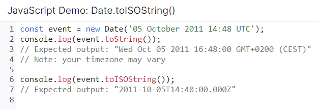

# 3장 리액트 훅 깊게 살펴보기

- [3장 리액트 훅 깊게 살펴보기](#3장-리액트-훅-깊게-살펴보기)
- [3.1 리액트의 모든 훅 파헤치기](#31-리액트의-모든-훅-파헤치기)
  - [3.1.9 useLayoutEffect](#319-uselayouteffect)
    - [3.27](#327)
  - [3.1.10 useDebugValue](#3110-usedebugvalue)
  - [3.1.11 훅의 규칙](#3111-훅의-규칙)
  - [3.1.12 정리](#3112-정리)

# 3.1 리액트의 모든 훅 파헤치기

## 3.1.9 useLayoutEffect
- useLayoutEffect 함수의 시그니처는 useEffect와 동일하나, <br /> 모든 DOM의 변경, 즉 **렌더링 후에 useLayoutEffect의 콜백 함수 실행이 동기적으로 발생**한다.
  > **useEffect**: 애플리케이션 내 컴포넌트의 여러 값을 활용하여 동기적으로 부수효과 만듦

- 모든 DOM의 변경, 즉 **렌더링 후에 useLayoutEffect의 콜백 함수 실행이 동기적으로 발생**한다. <br/> = 브라우저에 실제로 해당 변경 사항이 반영되는 시점이 아니다.

### 3.27
```js
function App() {
  const [count, setCount] = useState(0);
  
  useEffect(() => {
    console.log('useEffect', count)
  }, [count])

  // useEffect 보다 항상 먼저 실행
  useLayoutEffect(() => {
    console.log('useEffect', count)
  }, [count])

  function handleClick() {
    setCount((prev) => prev + 1)
  }

  return (
    <>
      <h1>{count}</h1>
      <button onClick={handleClick}>+</button>
    </>
  )
}
```
1. 리액트가 DOM을 업데이트
2. `useLayoutEffect`를 실행 = **브라우저에 변경 사항이 반영되기 전**
3. 브라우저에 변경 사항을 반영
4. `useEffect`를 실행 = **브라우저에 변경 사항이 반영된 후**

useLayout 은 동기적으로 발생하여 컴포넌트가 잠시 동안 일시 중지되는 것과 같은 일이 발생하게 됩니다.
따라서, **DOM은 계산됐지만 화면에 반영되기 전에 하고 싶은 작업이 있을 때** 사용한다.

## 3.1.10 useDebugValue
리액트 애플리케이션 개발 과정에 쓰이며, 디버깅하고 싶은 정보를 사용하여 리액트 개발자 도구에서 볼 수 있다.
- 사용자 정의 훅 내부의 내용에 대한 정보를 남길 수 있는 훅
- 두 번째 인수로 포매팅 함수 전달시 값 변경되었을 때만 호출되어 포메팅된 값을 노출한다.
- 오직 다른 훅 내부에서만 실행할 수 있다.

```js
function useDate() {
  const date = new Date()
  // useDebugValue로 디버깅 정보를 기록
  useDebugValue(date, (date) => `현재 시간: ${date.toISOString()}`)
  return date;
}
```
  > [Date.prototype.**toISOString()**](https://developer.mozilla.org/ko/docs/Web/JavaScript/Reference/Global_Objects/Date/toISOString) <br /> 단순화한 확장 ISO 형식(ISO 8601)의 문자열을 반환 

## 3.1.11 훅의 규칙

## 3.1.12 정리
