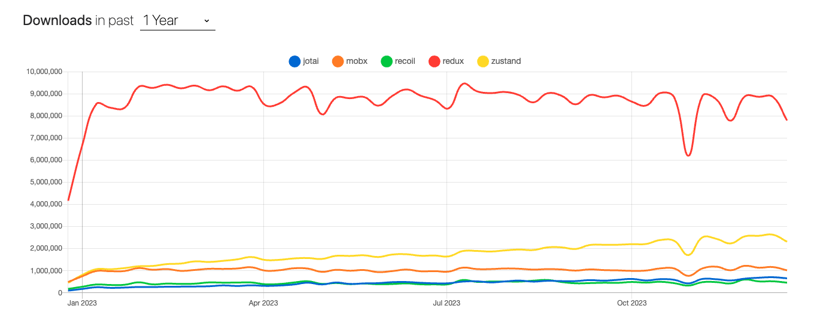
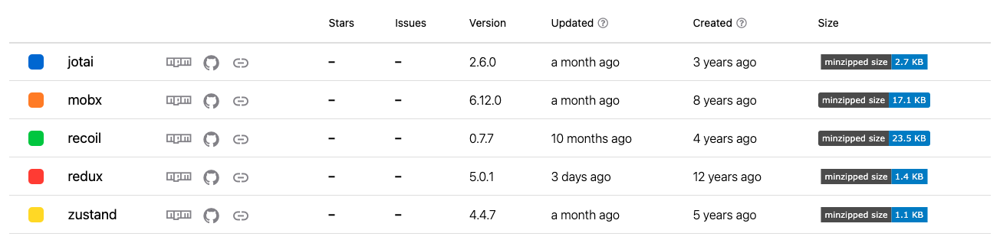

# 5장 리액트와 상태 관리 라이브러리

- [5장 리액트와 상태 관리 라이브러리](#5장-리액트와-상태-관리-라이브러리)
- [5.2 리액트 훅으로 시작하는 상태 관리](#52-리액트-훅으로-시작하는-상태-관리)
  - [5.2.4 상태 관리 라이브러리 Recoil, Jotai, Zustand 살펴보기](#524-상태-관리-라이브러리-recoil-jotai-zustand-살펴보기)
    - [Zunstand 의 바닐라 코드](#zunstand-의-바닐라-코드)
    - [Zustand의 리액트 코드](#zustand의-리액트-코드)
    - [간단한 사용법](#간단한-사용법)
    - [특징](#특징)
  - [5.2.5 정리](#525-정리)

# 5.2 리액트 훅으로 시작하는 상태 관리

## 5.2.4 상태 관리 라이브러리 Recoil, Jotai, Zustand 살펴보기

Zustand 는 Redux에 영감을 받아 만들어졌습니다. Zustand 에서는 atom 이라는 개념으로 최소 단위의 상태를 관리하는것이 아닌 하나 하나의 스토어를 중앙 집중형으로 활용하여 스토어 내부에서 상태를 관리하고 있습니다.
따라서 Zustand를 이해하려면 하나의 큰 스토어가 어떻게 만들어지는지 봐야하고, 스토어를 시작으로 , 각 상태값을 어떻게 참조하는지, 또 리렌더링은 어떻게 유도하는지 알아보겠습니다.

### Zunstand 의 바닐라 코드

먼저 스토어 만드는 예제 코드를 살펴보겠습니다.

```ts
const createStoreImpl: CreateStoreImpl = (createState) => {
  type TState = ReturnType<typeof createState>;
  type Listener = (statse: TState, prevState: TState) => void;
  let state: TState;
  const listeners: Set<Listener> = new Set();
};

const setState: SetStateInternal<TState> = (partial, replace) => {
  const nextState =
    typeof partial === "function"
      ? (partial as (state: TState) => TState)(state)
      : partial;
  if (nextState !== state) {
    const previousState = state;
    state =
      replace ?? typeof nextState !== "object"
        ? (nextState as TState)
        : Object.assign({}, state, nextState);
    listeners.forEach((listener) => listener(state, previousState));
  }
};

const getState : () => TState = () => state


const subscribe : (listener : Listener) => () => void = (listener) => {
  listeners.add(listener)
  return () => listeners.delete(listener)
}

const destory : () => void = () => listener.clear()
const api = { setState, getState, subscribe, destory }
state = (createState as PopArgument<typeof createState>)(
  setState, getState, api
)
return api as any
}

`getState` : 현재 상태 반환
`subscribe` : 상태 변경감지 리스너 추가 , 해당 리스터 제거
`destory` :  모든 리스너 제거

```

여기서 state라고 하는건 변수가 바로 스토어 상태값을 담아두는 곳이고,

`setState` 는 이 state 값을 변경하는 용도로 만들어져있습니다.
다른점은 partial 과 replace로 나눠져 있다는 점인데, partial 은 state의 일부만 변경하고 싶을때 사용하고 , replace는 state를 완전히 새로운 값으로 변경하고 싶을때 사용합니다.

`getState` 는 클로저의 최산 값을 가져오기 위해 함수로 만들어져 있습니다.

`subscribe`는 listener를 등록하는데 , listener는 마찬가지로 Set형태로 선언되어 추가와 삭제, 그리고 중복 관리가 용이하게끔 설계 되어있습니다.
`destory` 는 listener를 초기화하는 역할을 합니다.

코드를 보면 재밌는 점이 유일한 export 하는 변수가 `createStore` 라는 점이고 나머지는 다 `createStore` 를 사용하는데 필요한 타입뿐 이라는 점이였습니다.
그리고 어떤것도 import를 하지않고 있다는 점인데...
즉 ! store는 리액트를 비롯한 그 어떤 프레임워크와는 별개로 완전히 독립적으로 구성이 되어 있다고 알 수 있습니다.
따라서 이 store 파일의 이름처럼 순수하게 자바스크립트 환경에서도 사용 가능하다는 점입니다.

[Vanilla 코드](https://github.com/pmndrs/zustand/blob/main/src/vanilla.ts)

```ts
type CounterStore = {
  count: number;
  increase: (num: number) => void;
};

const store = createStore<CounterStore>((set) => ({
  count: 0,
  increase: (num: number) => set((state) => ({ count: state.count + num })),
}));

store.subscribe((state, prev) => {
  if (state.count !== prev.count) {
    console.log("count has been changed", state.count);
  }
});

store.setState((state) => ({ count: state.count + 1 }));
store.getState().increase(10);
```

한 가지 눈여겨 볼것은 createStore로 스토어를 만들때 set이라는 인수를 활용해 생성할 수 있다는 것이다. 이는 앞선 zustand의 createStore 예제 코드에서 살펴볼 수 있는 것처럼
state를 생성할 때 setState, getState, api를 인수로 넘겨줬기 때문에 가능하다. set을 통해 현재 스토어의 값을 재정의할 수도 있고, 두 번째 인수로 get을 추가해 현재 스토어 값을 받아올 수 있다.

### Zustand의 리액트 코드

바닐라 자바스크립트에서 Zustand를 사용하는 것도 좋지만 Zustand를 리액트에서 사용하기 위해서는 어디선가 store를 읽고 리렌더링 해야 한다.
타입을 제외하고 여기에서 export하는 함수는 바로 useStore, create다. 먼저 useStore부터 살펴보겠습니다.
[React 코드](https://github.com/pmndrs/zustand/blob/main/src/react.ts)

```ts
export function useStore<TState, StateSlice>(
  api: WithReact<StroeApi<TState>>,
  selector: (state: TState) => StateSlice = api.getState as any,
  equalityFn?: (a: StateSlice, b: StateSlice) => boolean
) {
  const slice = useSyncExternalStoreWithSelector(
    api.subscribe,
    api.getState,
    api.getServerState || api.getState,
    selector,
    equalityFn
  );
  useDebugValue(slice);
  return slice;
}
```

위에서 예시를 둔 useStore 코드는 매우 간결합니다. `useSyncExternalStoreWithSelector` 를 사용해 앞선 useStore의 subscribe, getState를 넘겨주고 스토어에서 선택을 원하는
state를 고르는 함수인 selector를 넘겨주고 끝난다. `useSyncExternalStoreWithSelector` 는 `useSyncExternalStore`와 완전히 동일하지만 원하는 값을 가져올 수 있는 selector과 동등 비교를 할 수 있는 `equalityFn`
함수를 받는 차이가 있다.

즉 객체가 예상되는 외부 상택낪에서 일부 값을 꺼내올 수 있도록 `useSyncExternalStoreWithSelector` 사용했다.

`useSyncExternalStore` 훅은 리액트 18에서 새롭게 만들어진 훅으로 리액트 외부에서 관리되는 상태값을 리액트에서 사용할 수 있도록 도와준다. 이 훅은 `10.2 리액트 18버전 살펴보기에서 다룬다.`

[useSyncExternalStore 관련 블로그](https://velog.io/@jay/useSyncExternalStore)
[useSyncExternalStore 공식문서](https://react.dev/reference/react/useSyncExternalStore#usesyncexternalstore)

또 Zustand 코드에서 export 하는 변수는 create 인데 , 이는 리액트에서 사용할 수 있는 스토어를 만들어 주는 변수이다.
[React 코드](https://github.com/pmndrs/zustand/blob/main/src/react.ts)

```ts
const createImpl = <T>(createState : StateCreator<T, [], []>) => {
  const api = typeof createState === 'function' ? createStore(createState) : createState

  const useBoundStore : any (selector? : any, equalityFn?: any) => useStore(api, selector, equalityFn)

  Object.assign(useBoundStore, api)

  return useBoundStore
}

const create = (<T>(createState : StateCreator<T, [], []> | undefined) => createState ? createImpl(createState) : createImpl) as Create

export default create
```

리액트의 create는 바닐라의 createStore를 기반으로 만들어졌기 때문에 거의 유사하다고 볼 수 있다. 다만 차이점은 useStore를 사용해 해당 스토어가 즉시 리액트 컴포넌트에서 사용할 수 있도록 만들어졌다는 것이다.
또한 useBoundStore에 api를 Object.assign으로 복사했는데, 이는 useBoundStore에 api의 모든 함수를 복사해서 api도 동일하게 사용할 수 있게 제공했다.

이러한 간결한 구조는 리액트 환경에서도 스토어를 생성하고 사용하기가 매우 쉽다.

```ts
interface Store {
  count: number;
  text: string;
  increase: (count: number) => void;
}

const store = createStore<Store>((set) => ({
  count: 0,
  text: "",
  increase: (num) => set((state) => ({ count: state.count + num })),
  setText: (text) => set({ text }),
}));

const counterSelector = ({ count, increase }: Store) => ({
  count,
  increase,
});

function Counter() {
  const { count, increase } = useStore(store, counterSelector);

  function handleClick() {
    increase(1);
  }

  return (
    <>
      <h3>{count}</h3>
      <button onClick={handleClick}>+</button>
    </>
  );
}

const inputSelector = ({ text, setText }: Store) => ({
  text,
  setText,
});

function Input() {
  const { text, setText } = useStore(store, inputSelector);

  useEffect(() => {
    console.log("Input Changed");
  });

  function handleChange(e: ChangeEvent<HTMLInputElement>) {
    setText(e.target.value);
  }

  return (
    <div>
      <input value={text} onChange={handleChange} />
    </div>
  );
}
```

스토어 생성 자체는 앞선 예제와 동일하다. 그리고 useStore를 사용하면 이 스토어를 리액트에서 사용이 가능하다.

### 간단한 사용법

Zustand로 간단하게 스토어를 만들어보고 사용법을 간단히 알아보겠습니다. 리액트에서 Zustand를 사용한다고 가정하고 예제코드를 살펴보겠습니다.

```ts
import { create } from "zustand";

const useCounterStore = create((set) => ({
  count: 1,
  inc: () => set((state) => ({ count: state.count + 1 })),
  dec: () => set((state) => ({ count: state.count - 1 })),
}));

function Counter(){
  const { count, inc, dec } = useCounterStore()

  return Counter(){
   <div>
    <span>{count}</span>
    <button onClick={inc}>+</button>
    <button onClick={dec}>-</button>
   </div>
  }
}
```

예제에서는 Zustand의 create를 활용해 스토어를 만들고 반환 값으로 이 스토어를 컴포넌트 내부에서 사용할 수 있는 훅을 받았습니다.
이 훅을 사용하면 스터오 내부에 있는 `getter` `setter` 모두에 접근해 사용 할 수 있게 됩니다.

또한 리액트 컴포넌트 외부에서도 store를 만드는것이 가능합니다.

```ts

import { createStore, useStore } from 'zustand'

const CounterStore = createStore((set) => ({
  count : 1,
    inc: () => set((state) => ({ count: state.count + 1 })),
    dec: () => set((state) => ({ count: state.count - 1 })),
}))

function Counter(){
  const { count, inc, dec } = useStore()

  return Counter(){
   <div>
    <span>{count}</span>
    <button onClick={inc}>+</button>
    <button onClick={dec}>-</button>
   </div>
  }
}
```

`createStore`를 사용하면 리액트와 상관없는 바닐라 스토어를 만들 수 있고, 이 바닐라 스토어는 useStore 훅을 통해 접근해 리액트 컴포넌트 내부에서 사용할 수 있게 됩니다.

### 특징

예제와 함께 Zustand의 특징을 정리해보겠습니다.
Zustand는 많은 코드를 작성하지 않아도 빠르게 스토어를 만들 수 있습니다. 이는 Redux와 확실히 구별되는 특징이고 간단하고 빠르게 상태 정의가 가능하여 관리하는 입장에서 한결 가볍고 편리하다.

가볍게 만들어준다는건 다른 상태괸리 라이브러리들보다 용량을 많이 차지 않는다입니다. `Bundlephobia` 기준으로 같은 코드로 크기를 비교 했을때 `Recoil` 은 79.1kB , `Jotai` 는 13.1kB , `Zustand` 는 2.9kB 밖에 안된다.
작은 크기 답게 초보자들이 사용하기에 아주 좋습니다.

`Jotai` 와 마찬가지로 TS 기반으로 작성돼 있기 때문에 별도로 `@types`를 설치하거나 임의로 작성하는 d.ts에 대한 우려 없이 타입스크립트를 자연스럽게 사용이 가능하다.

또한 `Zustand` 는 리덕스와 마찬가지로 미들웨어를 지원합니다.
create의 두 번째 인수로 원하는 미들웨어를 추가하면 되는데, 스토어 데이터를 영구히 보존할 수 있는 persist, 복잡한 객체를 관리하기 쉽게 도와주는 immer, 리덕스와 함께 사용할 수 있는 리덕스 미들웨어 등 여러 가지 미들웨어를 제공합니다.

미들웨어를 사용한다면 sessionStorage에 추가로 저장하는 등 기본적인 상태 관리 작동 외에 추가적인 작업을 정의할 수도 있습니다.

## 5.2.5 정리

사실 `Redux`가 월등히 높지만 ... 그래도 !! 많이 성장하고 있다.



상태 관리 라이브러리가 사용하는 방식에 대해서 조금씩 차이는 있지만 어떠한 식으로 관리하든 방법은 동일합니다.

따라서 라이브러리 별로 특징을 파악하고 사용자가 잘 사용할 수 있고, 상황과 철학에 맞게 라이브러리를 선택해서 사용해야합니다.

여기서 중요한 점은 npm에서 제공하는 모든 라이브러리와 마찬가지로 많이 다운로드가 되고 이슈가 관리가 잘 되고있는 라이브러리를 선택하는것이 좋습니다.

리액트의 방향성에 따라 상태 관리 라이브러리도 리액트 변화에 맞게 꾸준히 대응해 줄 필요가 있습니다. 만약 사용하는 라이브러리가 이런 대응이 어렵다면 장기적인 유지보수 및 개선에 어려움이 있을 수 있습니다.

저희가 지금까지 배운 모든 라이브러리들은 다운로드수도 많고 제법 상위권에 있어서 크게 사용하는데 어려움은 없습니다.


