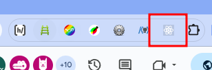
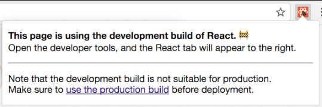
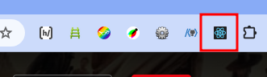

# 6장 리액트 개발 도구로 디버깅하기

- [6장 리액트 개발 도구로 디버깅하기](#6장-리액트-개발-도구로-디버깅하기)
  - [6.2 리액트 개발 도구 설치](#62-리액트-개발-도구-설치)

## 6.2 리액트 개발 도구 설치

1. 브라우저에 리액트 개발 도구를 브라우저 확장 도구로 설치 ( 크롬, 파이어폭스, 엣지 브라우저)

2. 설치가 완료 되었다면 크롬의 우측 상단에 확장 도구 모음에 리액트 로고가 표시됨.

- > 🩶회색 리액트 로고 : 리액트 개발 도구가 정상적으로 접근할 수 없는 페이지, 리액트로 개발되지 않은 페이지
  > 

 

- > ❤️빨간 리액트 로고 : 현재 웹페이지가 리액트 개발 모드로 실행되고 있다는 뜻
  > 

 

- > 🩵파란 리액트 로고 : 현재 웹페이지가 리액트 프로덕션 모드로 빌드되어 실행
  > 
