# 6장 리액트 개발 도구로 디버깅하기

- [6장 리액트 개발 도구로 디버깅하기](#6장-리액트-개발-도구로-디버깅하기)
  - [6.3 리액트 개발 도구 활용하기](#63-리액트-개발-도구-활용하기)
    - [6.3.1 컴포넌트](#631-컴포넌트)
      - [Components 탭](#components-탭)
        - [🌳컴포넌트 트리](#컴포넌트-트리)
        - [기명 함수로 쉽게 바꾸기 : `displayName`속성을 추가](#기명-함수로-쉽게-바꾸기--displayname속성을-추가)
      - [컴포넌트명과 props](#컴포넌트명과-props)
      - [1️⃣컴포넌트명과 Key](#1️⃣컴포넌트명과-key)
      - [2️⃣컴포넌트 도구](#2️⃣컴포넌트-도구)
      - [3️⃣컴포넌트 props](#3️⃣컴포넌트-props)
      - [4️⃣ 컴포넌트 hooks](#4️⃣-컴포넌트-hooks)
      - [컴포넌트를 랜더링한 주체, rendered by](#컴포넌트를-랜더링한-주체-rendered-by)
    - [6.3.2 프로파일러](#632-프로파일러)
      - [🔯 프로파일러](#-프로파일러)
      - [설정 변경하기](#설정-변경하기)
      - [프로파일링](#프로파일링)
        - [프로파일링 메뉴](#프로파일링-메뉴)
        - [Flamegraph](#flamegraph)
        - [Ranked](#ranked)
        - [Timeline](#timeline)
      - [프로파일러로 렌더링 원인파악해서 수정해보기](#프로파일러로-렌더링-원인파악해서-수정해보기)
  - [6.4 정리](#64-정리)

## 6.3 리액트 개발 도구 활용하기

- 리액트 개발 도구 정상적으로 설치가 완료되고 디버깅 할 수 있는 페이지에 접근했다면 크롬 개발자 도구에 **Components와 Profiler가 추가**된 것을 확인할 수 있다.
  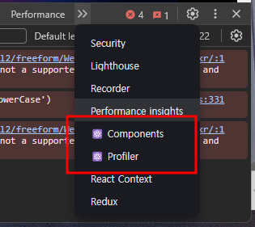

**Components와 Profiler**

- 리액트 개발자 도구에서 제공하는 디버그 도구
- 리액트 애플리케이션에서 일어나는 대부분의 작동을 확인할 수 있음.

### 6.3.1 컴포넌트

#### Components 탭

- 리액트 애플리케이션의 **컴포년트 트리를 확인**할 수 있다.
  (단순히 컴포년트의 구조뿐만 아니라 props와 내부 hooks 등 다양한 정보를 확인 가능)

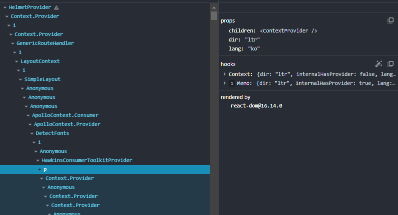

##### 🌳컴포넌트 트리

- 왼쪽 영역: 해당 리액트 페이지의 컴포넌트 트리를 나타낸다.
- 트리 구조로 구성

> 기명 함수로 선언되어 컴포넌트 명을 알 수 있다.
> 만약 익명 함수로 선언돼 있다면 `Anonymous`라는 이름으로 컴포넌트를 보여준다.

[예제 코드]

```js
App.tsx
// ...
import AnonymousDefaultcomponent from './Component3'

//기명함수: 함수 선언식
function Component1() {
return <>Component1</>
}

//기명함수: 함수 표현식
const Component2 = () => {
return <>Component2</>
}

// `memo`를 사용해 익명 함수
const MemoizedComponent = memo(() => <>MemoizedComponent</>)

const withSampleHOC = (Component: ComponentType) => {
  return function () {
    return <Component />
  }
}
// withsampleHOC로 감싼 고차 컴포넌트
const HOCComponent = withsampleHOC(() => <HOCComponent</>)

export default function App() {
return (
    <div className="App">
      <Component1 />
      <Component2 />
      <AnonymousDefaultComponent />
      <MemoizedComponent />
      <HOCComponent />
    <div>
  )
}
// Component3.tsx

//익명함수
export default () => {
  return <>Component3</>
}
```

- 이 컴포넌트를 렌더링해서 리액트 개발 도구에서 확인하면 다음과 같다.
  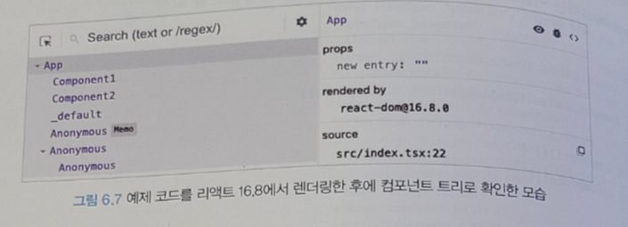
- 함수 선언식, 함수 표현식으로 생성한 컴포넌트는 모두 정상적으로 함수명 표시
- BUT 함수 선언식, 함수 표현식이 아닌 컴포넌트는 문제가 생긴다.

  - 익명 함수를 default로 export한 `AnonymousDefaultComponent`의 경우 `AnonymousDefaultComponent`는 코드 내부에서사용되는 이름일 뿐, 실제로 default export로 내보낸 함수의 명칭은 추론할 수 없다. ➡️ `_default`로 표시

  - `memo`를 사용해 익명 함수로 만든 컴포년트를 감싼 경우. 함수명을 명확히 추론하지 못해서 Anonymous로 표시
  - 고차 컴포년트인 `withSampleHOC`로 감싼 `HOCComponent`의 경우 두 가지 모두 Anonymous로 선언돼 있다.

**위 예제는 리액트 16.8 버전:** 일부 익명 함수에 대해 컴포넌트 명칭을 제대로 추론하지 못한다.

**16.9 버전 이후 :** 이러한 문제가 일부 해결.
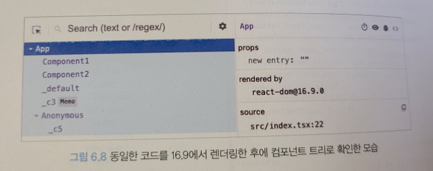

- 명칭을 추론할 수 없는 Anonymous가 \_c3, \_c5등으로 개선
  BUT, 컴포넌트를 특정하기 어려움

<br/>
➡️ 해결하기위해 기명 함수로 변겅
<br/>

[예제코드]

```js
const MemoizedComponent = memo(function MemoizedComponent() {
  return <>MemoizedComponent</>;
});

const withSampleHOC = (Component: ComponentType) => {
  return function withsampleHOC() {
    return <Component />;
  };
};
const HOCComponent = withsampleHOC(function HOCComponent() {
  return <>HOCComponent</>;
});
```

기명 함수를 실행한 코드를 리액트 개발자 도구로 살펴보면..

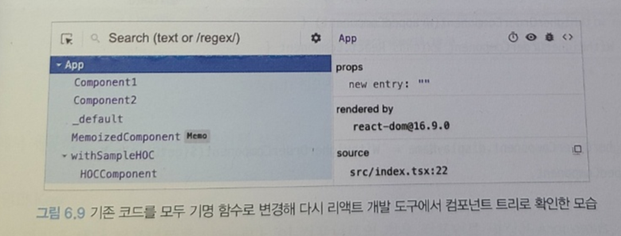

💁‍♂️기명 함수로 선언하는 것은 디버깅하는데 많은 도움이 된다.

🤔만약 기명 함수로 바꾸기 어렵다면 함수에 `displayName`속성을 추가하는 방법이 있다.

##### 기명 함수로 쉽게 바꾸기 : `displayName`속성을 추가

```js
const MemoizedComponent = memo(function () {
  return <>MemoizedComponent</>;
});

MemoizedComponent.displayName = '메모 컴포넌트입니다.';
```

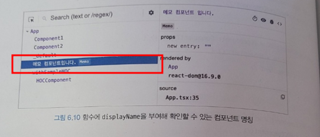

> ##### 💁‍♂️컴포넌트명 확인은 개발도구에서만~
>
> 1. 리액트를 빌드한 트리인 경우, 기명 함수로 선언해도 terser등의 압축 도구들이 **컴포넌트 명을 단순하게 난수화 하기 때문에 확인이 어려워짐**.
> 2. Component.displayName의 경우에도 빌드 도구가 사용하지 않는 코드로 인식해 **삭제할 가능성**이 있음 ➡️ **displayName과 함수명은 개발도구에서만 제한적 참고 권장**

#### 컴포넌트명과 props

왼쪽 컴포넌트를 선택했을 때 해당 컴포넌트에 대한 자세한 정보를 보여주는 영역
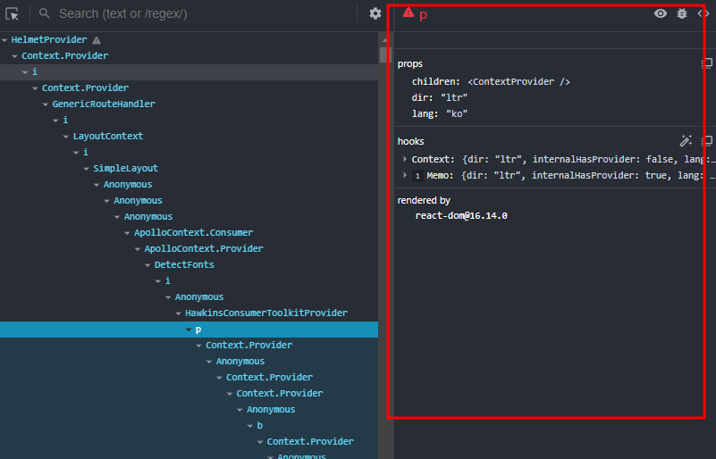

💁‍♂️영역별로 자세히 알아보자
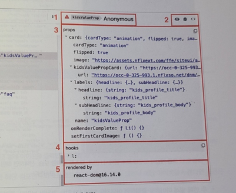

#### 1️⃣컴포넌트명과 Key

컴포넌트 명칭과 해당 컴포넌트를 나타낸다.

⚠️빨간색 경고 이모티콘: 해당 애플리케이션이 strick mode로 랜더링되지 않았다는 것을 의마한다.

#### 2️⃣컴포넌트 도구

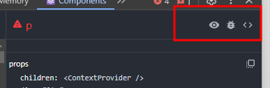

1. 👁️눈 아이콘: 해당 컴포넌트가 html의 어디에서 랜더링 됐는지 확인 가능.
2. 🐛벌레 아이콘: 클릭하는 순간 콘솔탭에 해당 컴포넌트의 정보가 console.log를 실행해 기록된 것을 확인할 수 있다. (props, hooks, nodes)
   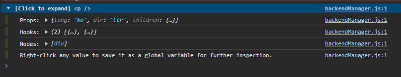
3. 소스코드 아이콘: 컴포넌트의 소스코드 확인

#### 3️⃣컴포넌트 props

해당 컴포넌트가 받은 props를 확인 가능. 단순한 원시값뿐만 아니라 함수도 포함돼 있다.

1. 오른쪽 버튼 클릭하면, 2가지 버튼이 나온다. 전자는 클립보드로 복사, 후자는 `window.$r`에 해당 정보가 담긴다.

- 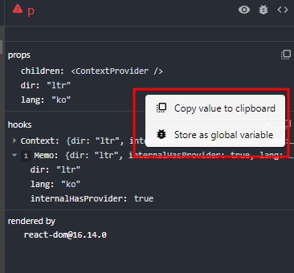

2. 값이 함수인 props를 누르면 `Go to definition`이 나타남. 이를 클릭하면 해당 함수가 선언된 코드로 이동

#### 4️⃣ 컴포넌트 hooks

컴포넌트에서 사용 중인 훅 정보를 확인. 여기서 `useState`는 `State`와 같이 `use`가 생략된 이름으로 나타남.
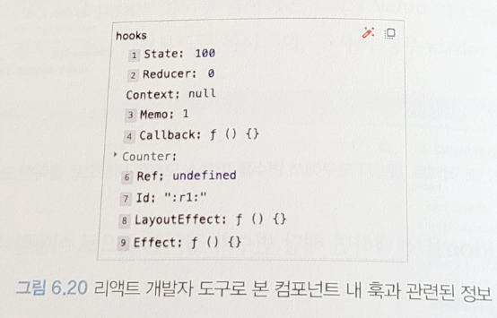

훅에 넘겨주는 함수를 익명 함수 대신 기명 함수로 넘겨주면 해당 훅을 실행할 때 실행되는 함수의 이름을 확인 할 수 있다.

```js
// before
useEffect(() => {
  console.log('useEffect');
});

// after
useEffect(function effectonlyMount() {
  console.log('useEffect');
});
```

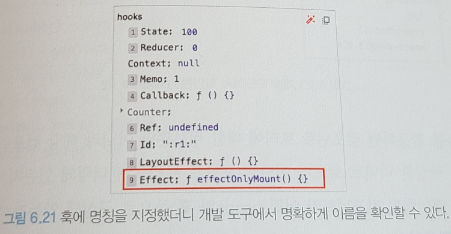

#### 컴포넌트를 랜더링한 주체, rendered by

`rendered by` 해당 컴포넌트를 랜더링한 주체가 누구인지 확인할 수 있다.

> **프로덕션 모드:** react-dom의 버전만 확인 가능
> 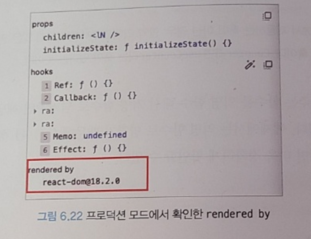 > **개발 모드:** 해당 컴포넌트를 렌더링한 부모 컴포넌트까지 확인 가능.
> 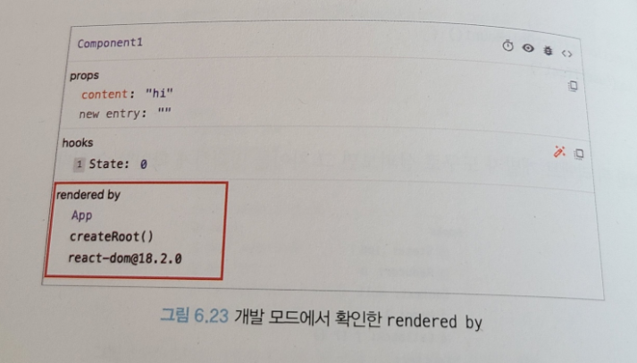

컴포넌트 트리에 대한 정보 뿐만 아니라 해당 컴포넌트에 대한 자세한 정보를 확인할 수 있다.

> **💁‍♂️이렇게 리액트 개발자 도구는 편리하다아~**
>
> - 작성한 리액트 코드가 어떤 컴포넌트 트리로 렌더링돼 있는지
> - 어떻게 HTML로 반영됐는지
> - 랜더링된 컴포넌트가 어떤 props와 훅 등으로 구성돼 있는지

### 6.3.2 프로파일러

#### 🔯 프로파일러

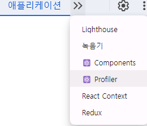

- 리액트가 렌더링하는 과정에서 발생하는 상황을 확인하기 위한 도구
- 렌더링하는 과정에서 어떤 컴포넌트가 렌더링 됐는지
- 몇 차례나 렌더링이 일어났으며 어떤 작업에서 오래 걸렸는지
  => 렌더링 과정에서 발생하는 일을 확인

[🟣 프로파일러 사용을 위해 준비한 예제 코드]

```js
import { ChangeEvent, useEffect, useState } from 'react';
import './App.css';

function App() {
  const [text, setText] = useState('');
  const [number, setNumber] = useState(0);
  const [list, setList] = useState([
    { name: 'apple', amout: 5000 },
    { name: 'orange', amout: 1000 },
    { name: 'watermelon', amout: 1500 },
    { name: 'pineapple', amout: 500 },
  ]);

  function handleTextChange(e: ChangeEvent<HTMLInputElement>) {
    setText(e.target.value);
  }

  function handleSubmit() {
    setList((prev) => [...prev, { name: text, amout: number }]);
  }

  function handleNumberChange(e: ChangeEvent<HTMLInputElement>) {
    setNumber(e.target.valueAsNumber);
  }

  useEffect(() => {
    setTimeout(() => {
      console.log('surprise!');
      setText('1000');
    }, 3000);
  }, []);

  return (
    <div>
      <input type="text" value={text} onChange={handleTextChange} />
      <button onClick={handleSubmit}>추가</button>

      <input type="number" value={number} onChange={handleNumberChange} />

      <ul>
        {list.map((v, i) => (
          <li key={i}>
            {v.name} {v.amout}원
          </li>
        ))}
      </ul>
    </div>
  );
}

export default App;
```

#### 설정 변경하기

- 톱니 모양의 설정 버튼

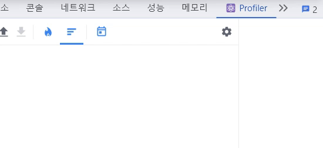

- 중요한 설정

| 이미지                                        | 설정                                                             | 설명                                                                                                                                  |
| --------------------------------------------- | ---------------------------------------------------------------- | ------------------------------------------------------------------------------------------------------------------------------------- |
| 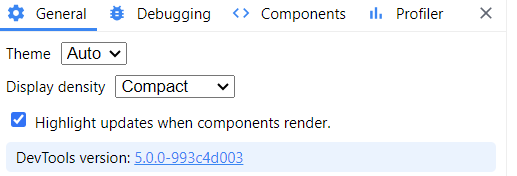 | General탭 - Highlight updates when components render             | 컴포넌트가 렌더링 될 때마다 해당 컴포넌트에 하이라이트를 표시, 매우 유용한 기능이므로 꼭 켜두는 것을 권장                             |
| 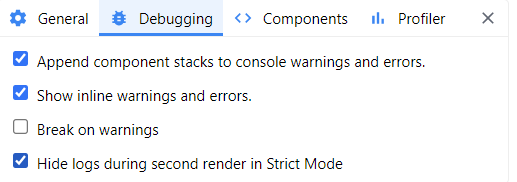 | Debugging 탭 - Hide logs during second render in Strict Mode     | 리액트 애플리케이션이 엄격 모드에서 실행되는 경우, 원활한 디버깅을 위해 `useEffect` 등이 두번씩 작동하는 의도적인 작동을 막을 수 있음 |
| 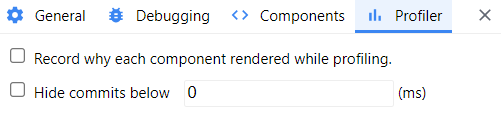 | Profiler 탭 - Record why each component rendered while profiling | 프로파일링 도중 무엇 때문에 컴포넌트가 렌더링 됐는지 기록, 속도가 느려질 수는 있지만 디버깅에 도움이 되는 옵션으로 켜두는 것을 권장   |

#### 프로파일링

###### 프로파일링 메뉴


- 리액트가 렌더링 할 때 어떠한 일이 벌어지는지 확인할 수 있는 도구

---

<p>♦️ Start Profiling (프로파일링 시작)<p>
- 프로파일링이 시작<br>
- 프로파일링이 중단되면 프로파일링 결과가 나타남<br> 
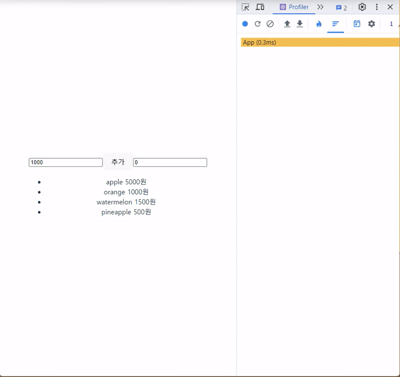

<p>♦️ Reload and Start profiling(새로고침 후 프로파일링 시작)<p>
- 웹 페이지가 새로고침되면서 이와 동시에 프로파일링 시작<br>
- 새로고침이 끝난다고 해서 프로파일링이 중단되지 않기 때문에 stop 버튼을 눌러주어야 중단됨<br>
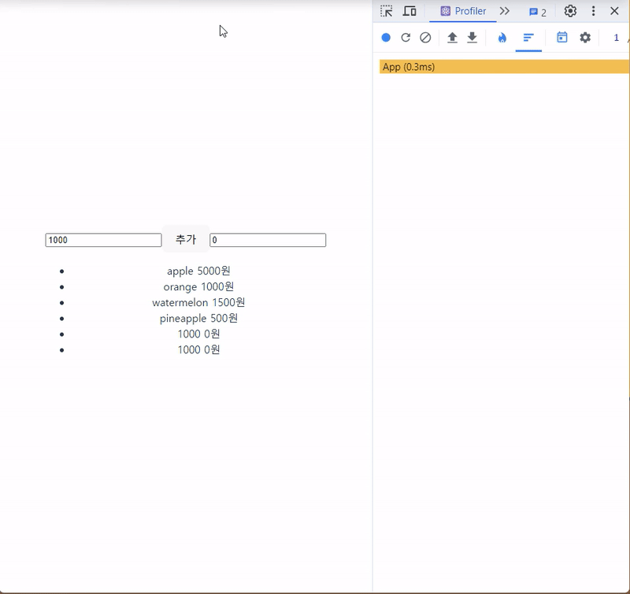

<p>♦️ 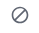Stop Profiling(프로파일링 종료)<p>
- 프로파일링된 현재 내용을 모두 지움

<p>♦️ Load Profile(프로파일 불러오기)<p>
- 프로파일링 결과를 불러옴

<p>♦️ 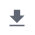Save Profile(프로파일 저장)<p>
- 프로파일링 결과를 저장함<br>
- 프로파일링 정보가 담긴 JSON 파일이 다운로드<br>
- 리액트 개발도구에서 저장하고 불러오는 용도기 때문에 직접 열어보면 필요한 정보를 확인하기 어려움<br>

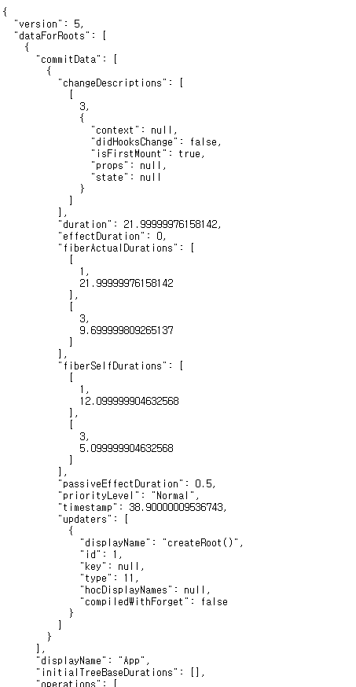

##### Flamegraph


- 렌더 커밋별로 어떠한 작업이 일어났는지 나타냄
- 다른 형태로 리액트 컴포넌트의 트리 구조를 확인할 수 있음
- 렌더링 되지않은 컴포넌트에 대한 정보도 확인 가능 (Did not render 표시)
- 이를 활용하면 개발자가 의도한 대로 메모이제이션이 작동하고 있는지, 혹은 특정 상태 변화에 따라서 렌더링이 의도한 대로 제한적으로 발생하고 있는지 확인하는데 도움이 됨
  <center>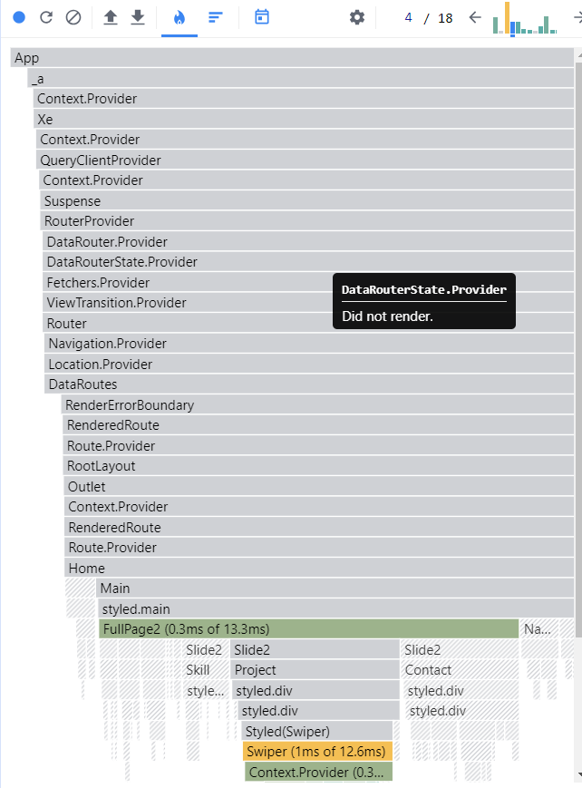</center>
  <center>주의! 예제코드가 아닌 다른 코드</center>

##### Ranked

- 렌더링하는데 오랜 시간이 걸린 컴포넌트를 순서대로 나열한 그래프
- `Flamegraph`와의 차이점은 모든 컴포넌트를 보여주는 것이 아니라 단순히 렌더링 발생한 컴포넌트만 보여준다는데 있음
- 렌더링되지 않은 정보는 필터링해서 보여주기 때문에 좀 더 간결하게 원하는 정보를 파악할 수 있음

<center>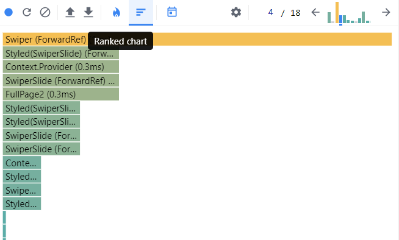</center>
<center>주의! 예제코드가 아닌 다른 코드</center>

##### Timeline

- 시간이 지남에 따라 컴포넌트에서 어떤 일이 일어났는지 확인
- 리액트 18 이상의 환경에서만 확인 가능
  <center>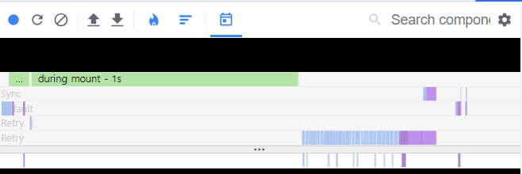</center>
  <center>주의! 예제코드가 아닌 다른 코드</center>

#### 프로파일러로 렌더링 원인파악해서 수정해보기

- 예제코드는 최초의 렌더링 이외에도 사용자가 아무런 작동을 하지 않았음에도 두 번째 렌더링이 발생한다 => Why?
<center>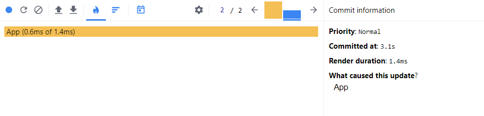</center>
<center>두 번째 커밋 클릭</center>
<br>
<center>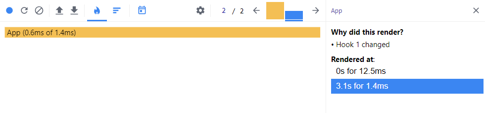</center>
<center>첫번째 훅으로 인해 렌더링이 발생된다는 원인 확인</center>
<br>
<center>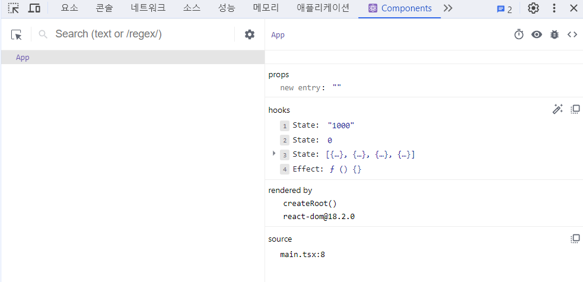</center>
<center>App의 hooks 확인</center>
<br>
<center>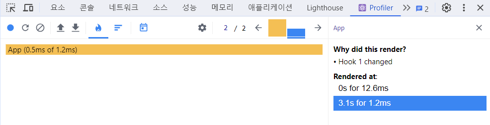</center>
<center>3.1s에 새로운 렌더링이 일어남</center>
<br>

=> 결과 : 디버깅한 경과를 종합해본다면 사용자가 아무런 작동을 하지 않아도 3초 경에 App의 state를 변경시키는 코드가 있다는 사실을 유추할 수 있음
=> But, 문제가 하나 더 있음!

<center></center>

[🟣 input을 별도의 컴포넌트로 분리한 예제]

```js
import { ChangeEvent, useState } from 'react';
import './App.css';

function InputText({ onSubmit }: { onSubmit: (text: string) => void }) {
  const [text, setText] = useState('');

  function handleSubmit() {
    onSubmit(text);
  }

  function handleTextChange(e: ChangeEvent<HTMLInputElement>) {
    setText(e.target.value);
  }

  return (
    <>
      <input type="text" value={text} onChange={handleTextChange} />
      <button onClick={handleSubmit}>추가</button>
    </>
  );
}

function App() {
  const [number, setNumber] = useState(0);
  const [list, setList] = useState([
    { name: 'apple', amout: 5000 },
    { name: 'orange', amout: 1000 },
    { name: 'watermelon', amout: 1500 },
    { name: 'pineapple', amout: 500 },
  ]);

  function onSubmit(text: string) {
    setList((prev) => [...prev, { name: text, amout: number }]);
  }

  function handleNumberChange(e: ChangeEvent<HTMLInputElement>) {
    setNumber(e.target.valueAsNumber);
  }

  return (
    <div>
      <InputText onSubmit={onSubmit} />
      <input type="number" value={number} onChange={handleNumberChange} />

      <ul>
        {list.map((v, i) => (
          <li key={i}>
            {v.name} {v.amout}원
          </li>
        ))}
      </ul>
    </div>
  );
}

export default App;
```

<center>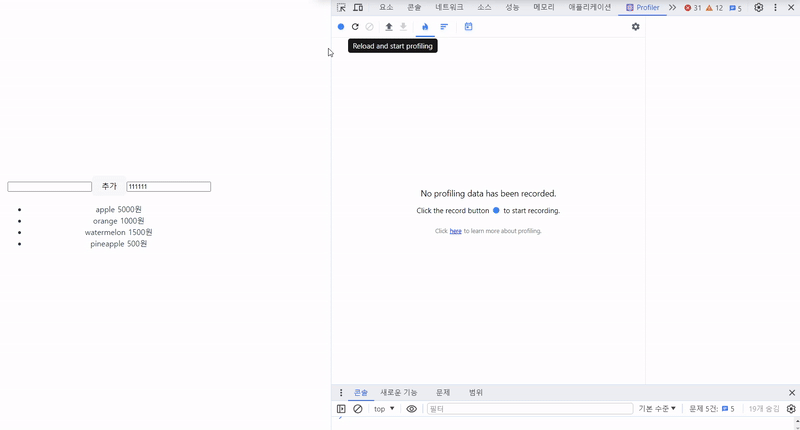</center>
<center>렌더링이 필요한 컴포넌트만 렌더링이 일어나고있음</center>
<br>

```js
function CopyrightComponent({ text }: { text: string }) {
  return <p>{text}</p>;
}

function InputText({ onSubmit }: { onSubmit: (text: string) => void }) {
  ...
  return (
    <>
      <input type="text" value={text} onChange={handleTextChange} />
      <button onClick={handleSubmit}>추가</button>
      <CopyrightComponent text="all right reserved" />
    </>
  );
}
```

- CopyrightComponent 컴포넌트는 고정된 `props`를 가지고 있지만 계속해서 리렌더링이 감지됨

```js
const CopyrightComponent = memo(function CopyrightComponent({
  text,
}: {
  text: string,
}) {
  return <p>{text}</p>;
});
```

<center>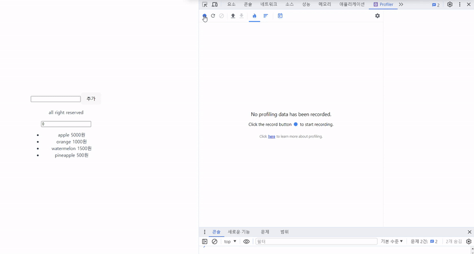</center>
<center>CopyrightComponent는 리렌더링이 일어나지않음</center>
<br>

## 6.4 정리

- 리액트 개발도구를 활용하면 정적으로 생성된 컴포넌트 트리를 보는것에서 부터 프로파일링을 통해 리액트 애플리케이션이 시간이 지남에 따라 어떤 식으로 작동하는지, 불필요한 리렌더링이 일어나고 있는지 등을 확인 가능
- 리액트 컴포넌트 구조가 복잡해지기 전에 틈틈히 리액트 개발도구를 활용해 디버깅을 수행해보는 습관을 기르는 것도 꿀팁!🍯
